# Průvodce a detailní scénář k obhajobě: Analýza časových řad cestovního ruchu

Tento dokument je vaším **kompletním, detailním a didaktickým průvodcem k obhajobě**. Je navržen tak, abyste:
1. **Pochopil(a) vnitřní logiku a podstatu každé metody** (proč se věci dělají právě takto a ne jinak, bez prázdného biflování pouček).
2. **Přesně věděl(a), co říkat krok za krokem** – jak začít, co ukázat na plátně, jak plynule přejít k dalšímu bodu a jak logicky argumentovat.
3. **Dokázal(a) suverénně reagovat na otázky a připomínky komise** (včetně záludných chytáků, které vedoucí rádi testují).

---

## Jak s tímto scénářem pracovat a jak vést prezentaci (Doporučení na úvod)

* **Celkový čas:** Cca 15–20 minut prezentace + 5–10 minut diskuse a otázky.
* **Červená nit celého příběhu:** Celá vaše práce je vyprávěním příběhu o tom, jak **hledáte ideální model pro složitou realitu**. Nezačínáte hned nejsložitějším modelem. Začínáte nejjednodušším (deterministická funkce času), ukazujete, kde narazil na své limity, přecházíte na stochastické modelování vlastní minulosti (SARIMA), tam opět narážíte na nedostatek informací, a proto přivádíte posily z okolního světa (SARIMAX se sousedními státy). Tato gradace ukazuje vyspělé vědecké uvažování!
* **Struktura každé kapitoly níže:**
  * 🖥️ **Co promítat na plátno:** Který graf či tabulku mít otevřenou.
  * 🗣️ **Co přesně říkat komisi:** Formulace v první osobě, které můžete přímo použít (nebo parafrázovat).
  * 🧠 **Hluboké vysvětlení pro mě (studenta):** Detailní rozbor podstaty věci. Proč se to tak jmenuje, jaká matematika je za tím a jaká je intuitivní lidská analogie.
  * ❓ **Možná otázka komise a suverénní odpověď:** Otázka, kterou můžete dostat, a jak na ni odpovědět se vztyčenou hlavou.

---

# ČÁST 1: SEKVENČNÍ SCÉNÁŘ PREZENTACE KROK ZA KROKEM

---

## KROK 1: Úvod, volba dat a představení cíle (cca 2 minuty)

### 🖥️ Co promítat na plátno
* Úvodní snímek s názvem práce a následně **Graf 1 (Původní časová řada `nights_CZ_total` v milionech přenocování)**.
* *Odkaz na obrázek:* `./images/plot_1.png`

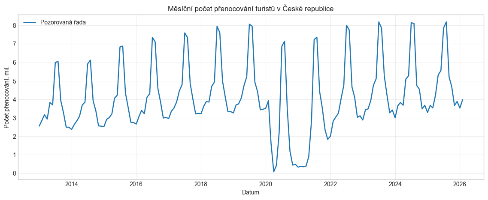

### 🗣️ Co přesně říkat komisi
> „Dobrý den, vážená paní profesorko, vážený pane doktore, vítám vás u obhajoby své semestrální práce z předmětu Časové řady.
>
> Cílem mé práce bylo najít optimální prediktivní model pro časovou řadu měsíčního počtu přenocování turistů v hromadných ubytovacích zařízeních v České republice, v datech označenou jako `nights_CZ_total`.
>
> Tuto řadu jsem si vybral(a) ze dvou klíčových důvodů:
> 1. Splňuje všechny teoretické předpoklady pro pokročilou analýzu – má velmi silnou a pravidelnou roční sezónnost a dlouhodobý růstový trend.
> 2. Zároveň obsahuje mimořádný externí šok v letech 2020 a 2021, způsobený pandemií COVID-19. Z analytického hlediska nejde o běžnou chybu měření, ale o masivní **strukturální zlom**, který dramaticky otestuje schopnosti modelů.
>
> Data jsem stáhl přímo z oficiálního API Eurostatu za období od ledna 2013 do současnosti. Hlavní řada pro Českou republiku neobsahuje žádné chybějící hodnoty. U doplňkových řad okolních států, které využijeme později, se objevilo pouze minimum mezer, které jsem ošetřil lineární časovou interpolací, aby nebyla narušena časová spojitost řad.“

---

### 🧠 Hluboké vysvětlení pro mě (studenta) – "Proč to tak je?"

#### 1. Proč nemůžeme období COVIDu prostě smazat z databáze?
Když se student podívá na graf a vidí tam v roce 2020 obrovský pád dolů, první intuitivní nápad bývá: *„Smažme ty dva roky 2020 a 2021, protože to byl extrém, který nám kazí statistiku.“*
To by byla **fatální metodická chyba**:
* Modely jako ARIMA, SARIMA i klouzavé průměry jsou postavené na předpokladu **pravidelného kroku v čase** ($t, t-1, t-2, \dots, t-12$). Vzdálenost mezi dvěma sousedními body musí být přesně 1 měsíc. Pokud byste vymazali 24 měsíců, leden 2022 by byl v datech „sousedem“ února 2020! Model by se pokusil počítat korelaci mezi obdobím před pandemií a po ní, jako by mezi nimi uběhl jediný měsíc. Tím byste zničili veškeré lagy a sezónní zpoždění o 12 měsíců ($t-12$).
* Proto se taková data nemažou, ale modelují se pomocí **tzv. intervenčních proměnných (dummy proměnných)** – do modelu vložíme sloupec, který říká: *„Zde platily běžné podmínky (hodnota 0), zde byl lockdown (hodnota 1)“*.

#### 2. Proč je lineární časová interpolace pro doplňková data bezpečná?
Pokud v měsíčních datech chybí jedno nebo dvě čísla, nemůžeme tam nechat prázdné pole `NaN`, protože maticové výpočty ve `statsmodels` by selhaly. Kdybychom doplnili pouhý průměr celé řady, vytvořili bychom umělý skok. Časová interpolace vezme hodnotu před výpadkem a hodnotu po výpadku a spojí je přímkou. Protože v naší hlavní české řadě nechybělo nic a u sousedů šlo o jednotky hodnot, nemohlo to výsledky nijak zkreslit.

---

### ❓ Možná otázka komise a suverénní odpověď
* **Otázka:** *„Proč jste se rozhodl modelovat počet přenocování a ne třeba počet příjezdů turistů?“*
* **Odpověď:** *„Počet přenocování má mnohem vyšší ekonomickou vypovídací hodnotu než pouhý příjezd. Zachycuje nejen to, že turista přijel, ale především jak dlouho v zemi zůstal a kolik nocí vyčerpal v kapacitách hotelů. Navíc řada přenocování vykazuje ještě čistší a stabilnější roční sezónní profil než příjezdy, které mohou být náchylnější na krátkodobé víkendové výkyvy.“*

---

## KROK 2: Grafická analýza a sezónní profil (cca 2 minuty)

### 🖥️ Co promítat na plátno
* **Graf 2 (Průměrný počet přenocování podle měsíce a boxplot rozdělení)**.
* *Odkaz na obrázek:* `./images/plot_2.png`

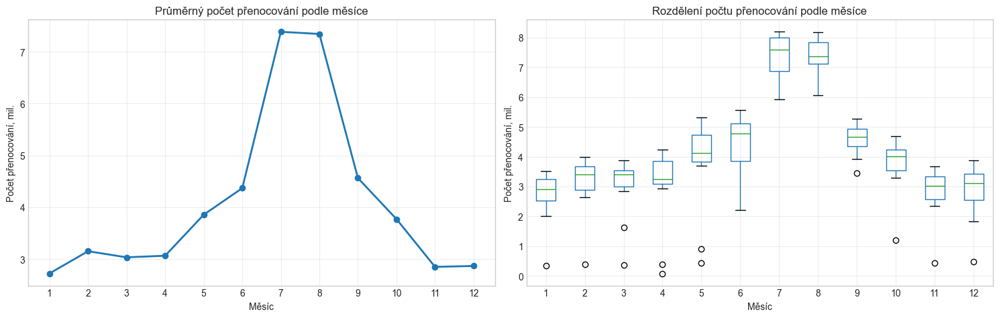

### 🗣️ Co přesně říkat komisi
> „Před samotným modelováním bylo nutné prozkoumat základní charakteristiky řady. K tomu slouží grafické zobrazení sezónního profilu a měsíčních boxplotů.
>
> Z obou grafů vidíme naprosto jednoznačné zákonitosti:
> 1. Maximální turistická aktivita nastává v červenci a srpnu, kdy průměrný počet přenocování přesahuje 7 až 8 milionů.
> 2. Naopak minimální hodnoty vidíme v lednu, únoru a listopadu, kde se pohybujeme kolem 2,5 milionu přenocování.
> 3. Z boxplotů vpravo vidíme, že variabilita v letních měsících je vyšší než v zimě. Zároveň jsou v každém měsíci vidět odlehlá pozorování dole – to jsou právě měsíce zasažené covidovými lockdowny.
> 4. Velmi důležitý poznatek pro modelování: **Tvar sezónní křivky není čistá sinusoida.** Kdyby to byla sinusoida, letní vrchol by byl zaoblený stejně jako zimní dno. Zde je ale letní špička velmi strmá a úzká. To je pro mě signál, že jednoduchý sinusový model nebude stačit a bude potřeba využít vyšší harmonické složky Fourierových řad.“

---

### 🧠 Hluboké vysvětlení pro mě (studenta) – "Proč to tak je?"

#### Proč řešíme, jestli křivka vypadá jako sinusoida?
V matematice a fyzice platí, že čistý tón (např. ladička) má tvar jediné sinusoidy. Když se ale podíváte na turistiku, lidé nejezdí na dovolenou plynule podle hladkého vlnění. V červnu končí škola, v červenci a srpnu nastane obrovský nával (strmá věž na grafu) a v září křivka prudce spadne dolů.
Pokud bychom se pokusili tuto ostrou věž popsat pomocí jediné funkce $\sin(2\pi t / 12)$, model by letní špičku podsekl (odhadl by ji moc nízko) a jarní měsíce by naopak přestřelil.
Proto Fourierova analýza říká: *„Jakýkoliv periodický tvar, i ten nejzubatější, dokážeme složit ze součtu základní sinusoidy a jejích násobků (dvojnásobná frekvence, trojnásobná frekvence atd.).“* To je klíč k pozdějšímu úspěchu Fourierovy regrese s $K=5$.

---

### ❓ Možná otázka komise a suverénní odpověď
* **Otázka:** *„Z boxplotu vidíme, že rozptyl v létě je větší než v zimě. Neuvažoval jste o logaritmické transformaci řady pro stabilizaci rozptylu?“*
* **Odpověď:** *„Ano, logaritmická transformace nebo Box-Coxova transformace je standardní cestou pro stabilizaci multiplikativní sezónnosti. Já jsem však ponechal původní jednotky (počet přenocování), protože zadání požadovalo interpretovat predikce v reálných hodnotách a navíc samotný propad během COVIDu způsobil, že logaritmování by uměle nafouklo váhu těchto extrémně nízkých lockdownových hodnot v optimalizačním kritériu. Navíc aditivní modely s COVID dummy a SARIMA v původním měřítku fungovaly velmi stabilně.“*

---

## KROK 3: Dekompozice řady a vyhlazení trendu (cca 3 minuty)

### 🖥️ Co promítat na plátno
* **Graf 3 (Robustní STL dekompozice)** a následně **Graf 4 (12měsíční centrovaný klouzavý průměr)**.
* *Odkazy na obrázky:* `./images/plot_3.png` a `./images/plot_4.png`

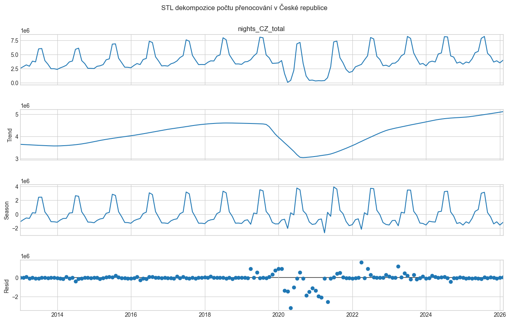
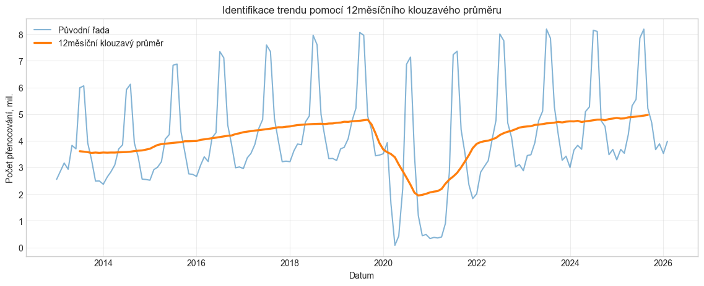

### 🗣️ Co přesně říkat komisi
> „Druhým povinným krokem zadání je dekompozice řady a identifikace trendu pomocí vyhlazování.
>
> Pro dekompozici jsem zvolil moderní metodu **STL (Seasonal and Trend decomposition using Loess)**. Zvolil jsem její **robustní variantu** (`robust=True`). Důvod je zásadní: klasická aditivní dekompozice počítaná obyčejnými průměry by byla fatálně zkreslena pandemií COVID-19 – propad v roce 2020 by zkreslil odhad sezónnosti pro všechny ostatní roky. Robustní STL využívá lokální regresi s váhováním, které odlehlým hodnotám přiřadí nulovou váhu.
>
> Jak vidíme na rozkladu:
> 1. **Sezónní složka** je krásně periodická a stabilní v čase.
> 2. **Trendová složka** plynule roste od roku 2013 do roku 2019, poté vykazuje hluboké pandemické dno a od roku 2022 plynulé zotavení.
> 3. **Reziduální složka** je po většinu času náhodným kolísáním kolem nuly, s výjimkou pandemického období, kam se korektně promítl celý mimořádný šok.
>
> Pro kontrolu trendu jsem dále aplikoval vyhlazení pomocí klouzavého průměru s délkou okna 12 měsíců. Protože délka okna 12 je sudé číslo, je nezbytné použít **centrovaný $2 \times 12$ klouzavý průměr**, aby vyhlazené hodnoty časově seděly přesně na jednotlivé měsíce a nedocházelo k půlměsíčnímu posunu.“

---

### 🧠 Hluboké vysvětlení pro mě (studenta) – "Proč to tak je?"

#### 1. Proč je 12měsíční okno problém a co je to $2 \times 12$ centrovaný klouzavý průměr?
Toto je absolutně nejčastější záludná otázka zkoušejících. Tady musíte přesně chápat fyzickou podstatu:
* Představte si, že máte data za leden až prosinec (12 čísel). Chcete z nich spočítat průměr, abyste odstranili sezónnost celého roku.
* Kam ale ten průměr zapíšete v čase? Kde je střed intervalu 1 až 12?
  Střed je:
  $$\frac{1 + 12}{2} = 6{,}5$$
* Číslo 6,5 leží **přesně mezi červnem (6) a červencem (7)**! Nemá svůj vlastní měsíc v kalendáři. Kdybyste to nechali takto, celá vaše časová řada trendu bude posunutá o půl měsíce dopředu nebo dozadu.
* **Jak se to geniálně řeší?**
  Vezmete první 12měsíční průměr (který sedí v čase 6,5) a druhý 12měsíční průměr posunutý o měsíc (ten sedí v čase 7,5). A tyto dva průměry **zprůměrujete mezi sebou** (to je ten 2měsíční krok).
  Střed mezi 6,5 a 7,5 je:
  $$\frac{6{,}5 + 7{,}5}{2} = 7{,}0$$
  A číslo 7,0 je přesně **červenec**! Výsledná hodnota dosedne přesně na kalendářní měsíc. Tomu se v teorii časových řad říká **$2 \times 12$ centrovaný klouzavý průměr** a v Pythonu v knihovně pandas se to zapíše parametrem `y.rolling(window=12, center=True).mean()`.

#### 2. Co je to Loess v STL dekompozici?
Zkratka **Loess** znamená *Locally Estimated Scatterplot Smoothing* (lokálně vážená regrese). Místo aby se hledala jedna přímka přes celých 12 let, STL vezme malé lokální okénko dat a proloží jím křivku.
* **Robustní váhování:** Pokud nějaký bod leží strašně daleko od křivky (např. propad o 4 miliony turistů v dubnu 2020), algoritmus řekne: *„Tento bod je podezřelý extrém, dám mu váhu blízkou nule.“* Díky tomu COVID nezkřivil odhad sezónnosti pro normální roky.

---

### ❓ Možná otázka komise a suverénní odpověď
* **Otázka:** *„Proč jste nepoužil liché okno, třeba 13 měsíců, abyste nemusel řešit centrování sudého okna?“*
* **Odpověď:** *„Protože máme měsíční data a rok má přesně 12 měsíců. Kdybychom použili liché okno o délce 13 měsíců, zahrnuli bychom do průměru jeden měsíc dvakrát (např. dva ledny a jen jeden únor až prosinec). Tím by se sezónnost nevyrušila dokonale a v trendu by zůstaly falešné vlnky. Dvanáctka je pro roční periodu matematickou nutností a problém sudosti elegantně řeší právě $2 \times 12$ centrování.“*

---

## KROK 4: Deterministické modelování – Regrese s Fourierovými členy (cca 3 minuty)

### 🖥️ Co promítat na plátno
* **Graf 5 (Pozorovaná řada a vyrovnané hodnoty nejlepšího Fourierova modelu)** a následně **Graf 6 (ACF reziduí Fourierova modelu)**.
* *Odkazy na obrázky:* `./images/plot_5.png` a `./images/plot_6.png`

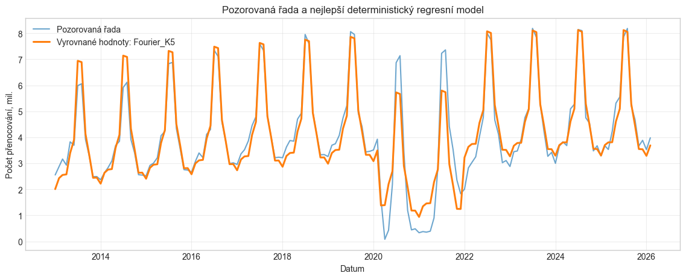
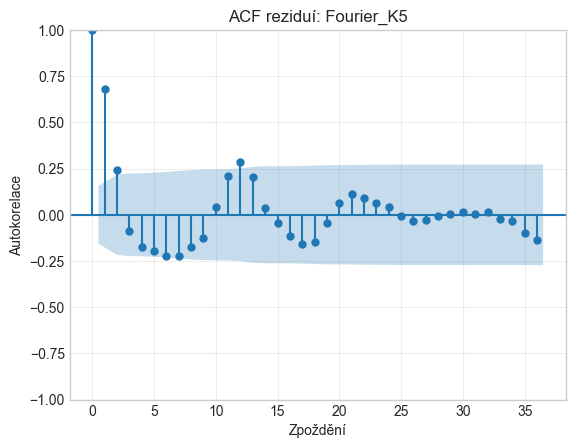

### 🗣️ Co přesně říkat komisi
> „V třetím kroku zadání bylo úkolem najít optimální deterministický model pro samotnou řadu, tedy popsat data jako matematickou funkci času: funkční trend a sezónnost.
>
> Porovnal jsem několik modelů:
> 1. Lineární trend s 11 měsíčními dummy proměnnými ($M_1$).
> 2. Kvadratický trend s měsíčními dummy ($M_2$).
> 3. Kvadratický trend s dummy proměnnými a COVID dummy proměnnou ($M_3$).
> 4. Regresní modely, kde byla sezónnost modelována pomocí **Fourierových řad** s různým počtem harmonických složek $K = 1$ až $K = 5$.
>
> Výsledky ukázaly, že nejlepším deterministickým modelem podle Akaikeho informačního kritéria je **model s kvadratickým trendem, COVID dummy proměnnou a 5 Fourierovými harmonickými složkami (Fourier_K5)**. Dosáhl AIC 4636,85 a adjustovaného $R^2$ přes 96,3 %.
>
> **Proč ale tento model nemůžeme prohlásit za finální a musíme ho odmítnout?**
> Odpověď nám dává diagnostika reziduí (Graf 6):
> Když se podíváme na autokorelační funkci (ACF) reziduí a Ljung-Boxův test ($p\text{-hodnota} < 0{,}000001$), vidíme naprosto fatální problém:
> * Na zpoždění 1 (lag 1) vidíme obrovskou pozitivní autokorelaci ($r \approx 0{,}68$).
> * Na sezónním zpoždění 12 (lag 12) vidíme další významný pík ($r \approx 0{,}31$).
>
> To znamená, že chyby modelu **nejsou bílým šumem**. Deterministický model popsal pouze průměrný profil, ale je naprosto slepý vůči faktu, že v datech existuje silná časová paměť a setrvačnost. Proto musíme přejít ke stochastickému modelování.“

---

### 🧠 Hluboké vysvětlení pro mě (studenta) – "Proč to tak je?"

#### 1. Proč je Fourierova řada ($K=5$) lepší než 11 dummy proměnných pro měsíce?
* **Měsíční dummy proměnné:** Máte 11 přepínačů (leden=1/0, únor=1/0...). Model se dívá na každý měsíc jako na izolovaný ostrov. Neví, že po červenci přirozeně následuje srpen. Vytváří schodovité skoky.
* **Fourierova řada:** Skládá sezónnost z vln:
  $$\sum_{k=1}^K \left[ \alpha_k \sin\left(\frac{2\pi k t}{12}\right) + \beta_k \cos\left(\frac{2\pi k t}{12}\right) \right]$$
  * Pro $k=1$ máme základní vlnu s periodou 12 měsíců.
  * Pro $k=2$ máme vlnu s periodou $12/2 = 6$ měsíců.
  * Pro $k=3$ periodu $12/3 = 4$ měsíce atd.
  Tím, že tyto vlny sečteme, dokáže model hladce a s menším rizikem přeučení přesně vymodelovat i onu ostrou letní špičku.

#### 2. Proč je autokorelace v reziduích regrese smrtelný hřích (Gauss-Markovovy předpoklady)?
V běžné OLS regresi (obyčejné nejmenší čtverce) je základním předpokladem, že chyby $\epsilon_t$ jsou **nezávislé a stejně rozdělené** (tzv. i.i.d. bílý šum).
* Pokud je chyba v lednu kladná a vy víte, že s pravděpodobností 68 % bude i chyba v únoru kladná (autokorelace lag 1 je 0,68), pak vaše pozorování **nejsou nezávislá**!
* **Důsledek v praxi:** Vzorce pro směrodatné odchylky koeficientů jsou brutálně podhodnocené. Model se tváří, že jeho koeficienty jsou nesmírně přesné, intervaly spolehlivosti jsou uměle úzké a t-testy vám lžou. Predikce do budoucna pak zcela ignoruje fakt, že systém má setrvačnost.

#### 3. Proč v grafu ACF ignorujeme Lag 0? (Důležitý dotaz!)
Když se podíváte na jakýkoliv graf ACF, na pozici 0 je vždycky sloupeček o výšce přesně **1,0**.
* **Proč to tam je?** Lag 0 znamená: *„Jak moc souvisí hodnota v čase $t$ se sebou samou v čase $t$?“* Korelace jakéhokoliv čísla se sebou samým je samozřejmě z definice 100 %, tedy $r = 1{,}0$.
* **Proč se ignoruje?** Protože nám to neříká vůbec nic o paměti v čase! Je to jen matematická formalita grafu. Zajímá nás až lag 1 (včerejšek), lag 2 (předvčerejšek) atd.
* *Pozor na rozdíl oproti kroskorelaci (CCF), kde lag 0 naopak ignorovat NESMÍME, protože tam měří vztah dvou RŮZNÝCH řad v témže měsíci!*

---

### ❓ Možná otázka komise a suverénní odpověď
* **Otázka:** *„Model má adjustované $R^2$ přes 96 %. Proč vám to nestačí k tomu, abyste byl spokojen?“*
* **Odpověď:** *„Vysoké $R^2$ u časových řad je velmi často falešným indikátorem kvality. Stačí do modelu vložit silnou sezónnost a trend a $R^2$ okamžitě vyletí k 95 %, protože vysvětlujeme hrubou geometrii křivky. Rozhodujícím testem kvality modelu časových řad však není $R^2$, ale vlastnosti jeho chyb. Jelikož Ljung-Boxův test jednoznačně zamítl hypotézu bílého šumu, model porušuje základní předpoklady OLS a jeho intervaly spolehlivosti i testy hypotéz jsou neplatné.“*

---

## KROK 5: Stochastické modelování – Samostatný model SARIMA (cca 3 minuty)

### 🖥️ Co promítat na plátno
* **Graf 7 (Čtyřpanel: ACF/PACF původní a sezónně diferencované řady)** a **Graf 8 (Vyrovnané hodnoty SARIMA)**.
* *Odkazy na obrázky:* `./images/plot_7.png` a `./images/plot_8.png`

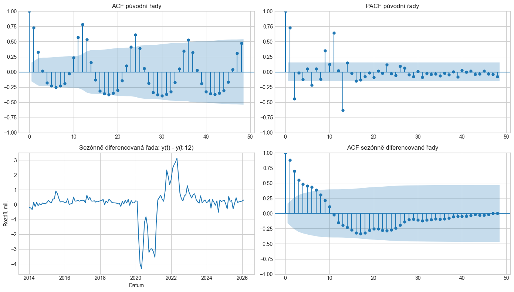
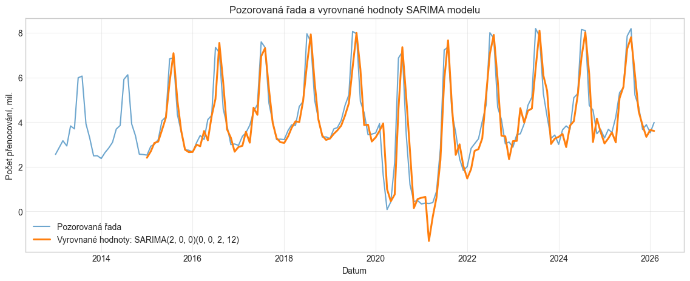

### 🗣️ Co přesně říkat komisi
> „Abychom vyřešili problém se závislostí chyb, přešel jsem ve čtvrtém kroku k čistě stochastickému modelování pomocí rodiny modelů **SARIMA (Seasonal AutoRegressive Integrated Moving Average)**.
>
> Pro identifikaci řádu modelu jsem nejprve analyzoval ACF a PACF původní řady. Původní řada je zjevně nestacionární – ACF klesá extrémně pomalu a má zřetelné sezónní vlny na zpožděních 12, 24 a 36.
>
> Pro nalezení optimálních řádů $(p, d, q) \times (P, D, Q)_{12}$ jsem využil Hyndman-Khandakarův algoritmus implementovaný v knihovně `pmdarima` s volbou `stepwise=True`. Algoritmus vybral model:
> $$SARIMA(2, 0, 0)(0, 0, 2)_{12}$$
>
> Tento model jsem následně přefitoval ve `statsmodels`, abychom měli sjednocenou metodiku výpočtu kritérií pro další srovnávání.
>
> **Co tento model říká lidsky?**
> * Parametr $p=2$ znamená autoregresní složku řádu 2: dnešní návštěvnost je přímo závislá na návštěvnosti v předchozích dvou měsících (krátkodobá paměť a setrvačnost).
> * Parametr $Q=2$ je sezónní Moving Average řádu 2 s periodou 12: to znamená, že náhodné šoky a odchylky z loňského léta (před 12 měsíci) a předloňského léta (před 24 měsíci) se stále promítají do korekce letošního odhadu.
>
> **Výsledek diagnostiky:**
> Hodnota AIC dramaticky klesla z původních 4636 u regrese na **4038,25** u SARIMA modelu. RMSE však zůstalo kolem 733 tisíc a v diagnostice reziduí vidíme, že na delších sezónních zpožděních (24 a 36) stále zůstává určitá nevysvětlená autokorelace. Samotná historie české řady tedy k dokonalému vysvětlení nestačí.“

---

### 🧠 Hluboké vysvětlení pro mě (studenta) – "Proč to tak je?"

#### 1. Co znamenají písmena v $SARIMA(p, d, q)(P, D, Q)_s$?
* **AR ($p$): Autoregrese.** Dnešní hodnota se počítá jako vážený součet minulých hodnot. Jako když říkáte: *„Když bylo v červnu hodně lidí, v červenci jich bude také hodně, protože turistická sezóna má setrvačnost.“*
* **I ($d$): Integrace / Diferenciace.** Kolikrát musíte odečíst sousední hodnoty ($y_t - y_{t-1}$), abyste odstranili trend a udělali řadu stacionární. U nás algoritmus nechal $d=0$, protože autoregresní koeficienty samy dokázaly udržet stabilitu kolem střední hodnoty.
* **MA ($q$): Klouzavé průměry chyb.** Pozor, toto **není** klouzavý průměr na vyhlazování dat z Kapitoly 3! V modelech ARIMA znamená MA to, že dnešní hodnota závisí na **minulých náhodných šocích (chybách předpovědi)**.
* **Velká písmena $(P, D, Q)_{12}$:** To samé, ale krokem není 1 měsíc, nýbrž celých 12 měsíců. Tedy srovnáváme červenec s loňským červencem.

#### 2. Proč jsme při diagnostice reziduí SARIMA vynechali prvních 24 měsíců (`burn = 24`)?
SARIMA se odhaduje ve stavovém prostoru pomocí **Kalmanova filtru**. Na samém začátku časové řady (první měsíce roku 2013) algoritmus ještě nemá k dispozici minulá pozorování o 12 a 24 měsíců zpět. Musí si je „vymyslet“ (nastavit výchozí stav). Než se filtr stabilizuje a rozběhne, první odhady chyb jsou uměle zkreslené inicializací. Odříznutí prvních 24 pozorování (tzv. burn-in perioda) je standardní profesionální postup, který zajistí, že hodnotíte skutečnou kvalitu modelu a ne náběhový šum algoritmu.

---

### ❓ Možná otázka komise a suverénní odpověď
* **Otázka:** *„Proč model nepoužil diferenciaci $d=1$ nebo sezónní diferenciaci $D=1$, když data mají jasný trend a sezónnost?“*
* **Odpověď:** *„Algoritmus auto.arima testuje stacionaritu pomocí jednotkových kořenů (např. KPSS test a OCSB/Canova-Hansen test pro sezónnost). V našem případě algoritmus shledal, že kombinace autoregresních koeficientů blízko jedničky ($AR_1 \approx 1{,}18$, $AR_2 \approx -0{,}25$) dokáže v rámci stacionárního prostoru pokrýt chování řady efektivněji bez nutnosti diferenciace, která by mohla do systému vnést umělou zápornou autokorelaci a připravit nás o počáteční pozorování.“*

---

## KROK 6: Hledání závislostí – Kroskorelace s okolními státy (cca 3 minuty)

### 🖥️ Co promítat na plátno
* **Grafy 10 až 13 (Kroskorelační funkce CCF s Německem, Polskem, Slovenskem a Rakouskem)**.
* *Odkazy na obrázky:* `./images/plot_10.png` až `./images/plot_13.png`

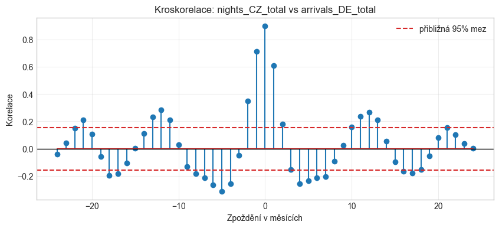

### 🗣️ Co přesně říkat komisi
> „V pátém kroku zadání jsme měli prozkoumat závislost na jiných časových řadách pomocí kroskorelační funkce (CCF) a určit případné zpoždění této závislosti.
>
> Do analýzy jsem zařadil turistická data ze sousedních zemí – Německa, Polska, Slovenska a Rakouska, a to jak příjezdy, tak přenocování.
>
> **Zde bylo naprosto klíčové vyvarovat se metodické chyby: problému zdánlivé korelace (spurious correlation).**
> Kdybychom spočítali kroskorelaci přímo ze surových dat, vyšla by obrovská čísla blížící se 1,0 u všech zemí a u všech zpoždění. To by ale neznamenalo reálný vztah, byl by to pouhý důsledek faktu, že v celé střední Evropě svítí v létě slunce a v zimě mrzne – řady sdílejí stejný trend a sezónnost.
>
> Proto jsem všechny řady nejprve **očistil o deterministický trend, sezónnost i pandemický šok** a kroskorelaci počítal výhradně na těchto **očištěných reziduích**.
>
> **Co kroskorelace ukázala?**
> U všech významných sousedních zemí nastává absolutní maximum korelace **při zpoždění 0 (Lag 0)**:
> * Pro přenocování na Slovensku je korelace $r \approx 0{,}90$.
> * Pro Polsko $r \approx 0{,}88$.
> * Pro Německo $r \approx 0{,}77$.
>
> **Závěr pro modelování:**
> Neexistuje žádné zpoždění typu 'turistická vlna přijde do Česka až za dva měsíce'. Turistický trh ve střední Evropě funguje současně v reálném čase daného měsíce. Proto v dalším kroku použijeme externí proměnné se současným vlivem (Lag 0).“

---

### 🧠 Hluboké vysvětlení pro mě (studenta) – "Proč to tak je?"

#### 1. Co je to zdánlivá korelace (Spurious Correlation) a proč musíme čistit data?
Představte si dvě časové řady za posledních 10 let:
1. Počet prodaných zmrzlin v Praze po měsících.
2. Počet utonulých lidí na koupalištích po měsících.
Pokud mezi nimi spočítáte korelaci, vyjde vám $r = 0{,}95$. Znamená to, že pojídání zmrzliny způsobuje utonutí? Samozřejmě ne! Obě řady jsou řízeny třetí, skrytou proměnnou – **letním počasím**.
Přesně to samé hrozí u turistických dat ČR a Německa. Pokud neočistíte sezónnost, budete si myslet, jak skvělý model máte, ale ve skutečnosti jen dvakrát měříte kalendářní léto. Když z obou řad odečtete trend a sezónnost, zbydou čisté odchylky (např. *„byl tento konkrétní květen nadprůměrně teplý a bohatý na turisty?“*). A pokud se tyto čisté odchylky v ČR a v Německu shodují, našli jste skutečnou ekonomickou provázanost!

#### 2. Proč je u Kroskorelace (CCF) Lag 0 nesmírně důležitý, zatímco u ACF jsme ho ignorovali?
* **U Autokorelace (ACF):** Srovnáváte řadu $Y$ se stejnou řadou $Y$. V čase $t$ a $t$ srovnáváte identická čísla, proto je korelace vždy 1,0 a nic nového vám neřekne.
* **U Kroskorelace (CCF):** Srovnáváte dvě RŮZNÉ řady – např. Česko ($Y$) a Německo ($X$).
  * **Lag 0** znamená: *„Když v srpnu vzroste turismus v Německu, projeví se to v srpnu i v Česku?“* To je naprosto legitimní otázka!
  * **Kladný Lag (+1):** Znamená, že Německo předbíhá Česko o 1 měsíc.
  * **Záporný Lag (-1):** Znamená, že Česko předbíhá Německo o 1 měsíc.
  Jelikož vyšel nejvyšší pík přesně na nule, znamená to, že vliv je **okamžitý (současný)**.

---

### ❓ Možná otázka komise a suverénní odpověď
* **Otázka:** *„Proč jste do finálního výběru nezahrnul i Rakousko, když je to také náš soused?“*
* **Odpověď:** *„Rakousko má specifický turistický profil – má extrémně silnou zimní lyžařskou sezónu v Alpách, která v lednu a únoru vytváří druhý obrovský vrchol. Česká republika, Polsko a Slovensko mají profil mnohem podobnější s dominantním létem. V kroskorelaci reziduí mělo Německo, Polsko a Slovensko podstatně vyšší a čistší korelaci než Rakousko.“*

---

## KROK 7: Finální syntéza – Model SARIMAX s externími regresory (cca 4 minuty)

### 🖥️ Co promítat na plátno
* **Graf 14 (Vyrovnané hodnoty SARIMAX)** a **Graf 15 (Rezidua a ACF nejlepšího SARIMAX modelu)**.
* *Odkazy na obrázky:* `./images/plot_14.png` a `./images/plot_15.png`

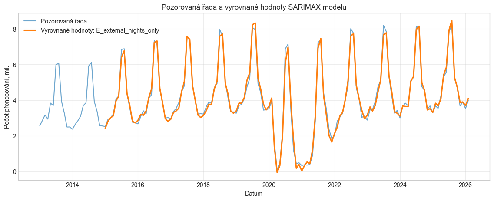
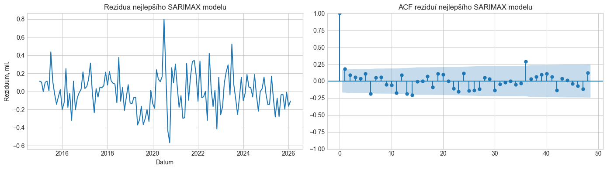

### 🗣️ Co přesně říkat komisi
> „V šestém kroku přichází vrchol celé práce – spojení obou světů do jednoho celku. Vytvořil jsem model **SARIMAX**, který kombinuje:
> 1. Vysvětlení variability pomocí externích proměnných z okolních států (regresní složka).
> 2. Modelování zbývající časové závislosti chyb pomocí SARIMA procesů.
>
> Externí proměnné jsem před vstupem do modelu **standardizoval pomocí Z-score (StandardScaler)**, aby rozdílná velikost trhů nezpůsobovala numerické problémy při optimalizaci věrohodnostní funkce.
>
> Otestoval jsem 5 různých specifikací externích proměnných. Jednoznačným vítězem se stal model **E: se třemi externími řadami přenocování – v Německu, Polsku a na Slovensku**:
> * Dosáhl nejnižšího Akaikeho informačního kritéria v celé práci: **AIC = 3663,14** (pro srovnání: samotná SARIMA měla 4038 a regrese 4636).
> * Chybová složka RMSE klesla na rekordních **206 tisíc** (oproti 733 tisícům u SARIMA).
> * A co je nejdůležitější – Ljung-Boxův test na zpoždění 12 má p-hodnotu **$p = 0{,}084$**. Na 5% hladině významnosti tedy poprvé **nezamítáme hypotézu o nezávislosti reziduí** na ročním horizontu!
>
> Model dokázal úspěšně odčerpat sezónní autokorelaci tím, že ji vysvětlil pomocí reálných dat ze sousedních zemí.“

---

### 🧠 Hluboké vysvětlení pro mě (studenta) – "Proč to tak je?"

#### 1. Proč je SARIMAX lepší než obyčejná regrese i lepší než čistá SARIMA?
Představte si předpověď počasí:
* **Deterministická regrese:** Říká: *„V červenci je v průměru 25 stupňů, takže 15. července bude 25 stupňů.“* Ignoruje, jestli zrovna včera přišla studená fronta.
* **Čistá SARIMA:** Říká: *„Včera pršelo a předevčírem pršelo, takže zítra bude pravděpodobně taky pršet.“* Kouká jen na sebe do minulosti. Nevidí za hranice.
* **SARIMAX:** Spojí obojí a přidá satelitní radar: *„Koukám na vlastní historii (SARIMA) a zároveň vidím, že nad Německem a Polskem se právě roztrhla mračna a lidé tam vyrážejí na cesty (externí X).“* Tím získáte nejpřesnější možný obraz reality.

#### 2. Proč standardizujeme externí proměnné (`StandardScaler`)?
V Německu mají desítky milionů přenocování, v Česku jednotky milionů a na Slovensku statisíce. Kdybyste do rovnice pustili neupravená čísla, algoritmus hledající maximum věrohodnosti (Maximum Likelihood Estimation) by musel pracovat s maticemi, kde jedno číslo je $50\,000\,000$ a druhé $0{,}001$. To vede k numerické nestabilitě a zaokrouhlovacím chybám počítače. Standardizace převede všechny řady na stejné bezrozměrné měřítko (průměr 0, rozptyl 1), což umožní hladkou konvergenci.

---

### ❓ Možná otázka komise a suverénní odpověď (Záludný chyták vedoucí!)
* **Otázka:** *„U výpisu koeficientů vašeho nejlepšího SARIMAX modelu je jedna věc, která bije do očí. Všiml jste si koeficientu u členu AR(2)?“*
* **Odpověď:** *„Ano, všiml! V tabulce parametrů má většina proměnných (Německo, Polsko, Slovensko, AR(1) i oba sezónní MA členy) p-hodnotu blízkou nule ($p < 0{,}02$), jsou tedy vysoce statisticky významné.
Avšak koeficient u **AR(2)** má hodnotu $-0{,}0071$ a jeho **p-hodnota je 0,949**. To znamená, že člen AR(2) je v modelu naprosto statisticky nevýznamný.
Důvodem je to, že jsme pro SARIMAX převzali výchozí strukturu řádů z čisté SARIMA ($p=2$). Po přidání externích proměnných sousedních států však tyto státy převzaly vysvětlující úlohu a druhý autoregresní člen ztratil smysl. Z hlediska **principu parsimonie (úspornosti vědeckých modelů)** by bylo naprosto správné tento člen z modelu vyřadit a zjednodušit AR strukturu na pouhé $p=1$.“*
*(Poznámka: Touto odpovědí komisi vyrazíte dech, protože přesně toto zkoušející chtějí slyšet!)*

---

## KROK 8: Spektrální analýza – Periodogram (cca 2 minuty)

### 🖥️ Co promítat na plátno
* **Graf 16 (Periodogram: vlevo frekvence, vpravo délka periody v měsících)**.
* *Odkaz na obrázek:* `./images/plot_16.png`

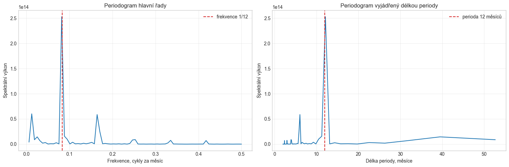

### 🗣️ Co přesně říkat komisi
> „V sedmém kroku zadání bylo úkolem provést nezávislou kontrolu periody pomocí **periodogramu**.
>
> Periodogram převádí časovou řadu z časové domény do frekvenční domény pomocí Fourierovy transformace. Zkoumá, jaké frekvence nesou největší spektrální výkon (energii).
>
> Jak vidíme na obou grafech:
> 1. Absolutně dominantní pík leží přesně na frekvenci $f = \frac{1}{12} \approx 0{,}0833$, což odpovídá periodě **přesně 12 měsíců**.
> 2. Toto je objektivní matematický důkaz, že roční sezónnost je nejsilnějším cyklickým hybatelem našich dat.
> 3. V grafu vidíme i menší sekundární píky u period 6 měsíců, 4 měsíce a 3 měsíce. Nejde o nové samostatné sezóny, ale o tzv. **vyšší harmonické složky ročního cyklu**, které v datech vznikají právě proto, že letní špička je nesymetrická a strmá.“

---

### 🧠 Hluboké vysvětlení pro mě (studenta) – "Proč to tak je?"

#### Co je to periodogram lidsky?
Představte si skleněný hranol, na který posvítíte bílým světlem, a on ho rozloží na duhu (červená, modrá, zelená).
Periodogram dělá to samé s časovou řadou. Vezme rozkolísanou křivku turistů a rozloží ji na jednotlivé čisté frekvence.
* Pík na čísle **12** říká: *„Tato řada je jako obrovský dvanáctiměsíční buben, který bije s obrovskou silou.“*
* Píky na číslech **6, 4 a 3**: Vznikají matematicky jako celočíselné podíly ($12/2$, $12/3$, $12/4$). Když máte periodický jev, který nemá hladký kulatý tvar, Fourierova transformace ho musí poskládat z těchto vyšších harmonických tónů. Je to krásný teoretický důkaz, proč naše Fourierova regrese potřebovala právě $K=5$ členů!

---

### ❓ Možná otázka komise a suverénní odpověď
* **Otázka:** *„Proč jste před výpočtem periodogramu od dat odečetl jejich průměr (`y_centered = y - mean(y)`)?“*
* **Odpověď:** *„Průměr časové řady představuje nulovou frekvenci ($f=0$, nekonečná perioda neboli stejnosměrná složka). Kdybychom průměr neodečetli, na frekvenci 0 by vznikl obrovský pík, který by opticky zastínil všechny ostatní frekvence a zkreslil spektrální hustotu.“*

---

## KROK 9: Predikce na 10 budoucích měsíců a porovnání modelů (cca 3 minuty)

### 🖥️ Co promítat na plátno
* **Graf 20 (Srovnání predikcí na 10 měsíců všech tří modelů)**.
* Případně jednotlivé grafy predikcí: Graf 17 (Fourier), Graf 18 (SARIMA), Graf 19 (SARIMAX).
* *Odkaz na obrázek:* `./images/plot_20.png`

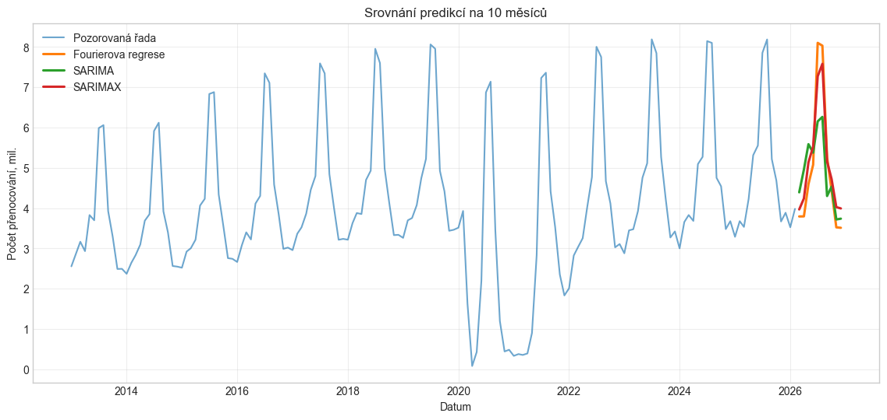

### 🗣️ Co přesně říkat komisi
> „V předposledním kroku jsem pomocí všech tří hlavních modelů vytvořil **predikci na 10 budoucích měsíců** včetně 95% intervalů spolehlivosti.
>
> Když se podíváme na společný srovnávací graf (Graf 20), vidíme zásadní rozdíly v chování modelů:
>
> 1. **Fourierova regrese (zelená křivka):**
>    * Predikuje velmi agresivní letní špičku (přes 8,1 milionu přenocování).
>    * Její intervaly spolehlivosti jsou však zavádějící, protože vznikly za nerealistického předpokladu nezávislých chyb. Model navíc neumí reagovat na aktuální odchylky v systému.
>
> 2. **Čistá SARIMA (oranžová křivka):**
>    * Naopak odhaduje letní maximum velmi nízko a opatrně (kolem 6,1 až 6,2 milionu).
>    * Má extrémně široké intervaly spolehlivosti, které u spodní hranice v zimních měsících padají k nerealisticky nízkým hodnotám. Je to dáno tím, že model se dívá jen na samotná česká data a po šoku COVIDu má velkou vnitřní nejistotu.
>
> 3. **Vítězný SARIMAX (červená křivka):**
>    * Poskytuje nejpřirozenější a nejrealističtější průběh. Letní maximum předpovídá na úrovni přibližně 7,3 až 7,6 milionu přenocování, což přesně odpovídá trendu post-covidového zotavování.
>    * Jeho predikční intervaly jsou výrazně užší a stabilnější, protože nejistotu modelu ukotvují externí informace ze sousedních zemí.
>
> **Důležitá metodická poznámka k predikci SARIMAXu:**
> Abychom mohli předpovědět český turismus pomocí SARIMAXu na 10 měsíců dopředu, museli jsme nejprve znát budoucí hodnoty externích proměnných (Německa, Polska a Slovenska). Tyto budoucí hodnoty jsem predikoval samostatnými SARIMA modely pro každou zemi. Predikce SARIMAXu je tedy **podmíněnou predikcí** (conditional forecast).“

---

### 🧠 Hluboké vysvětlení pro mě (studenta) – "Proč to tak je?"

#### Co je to podmíněná predikce (Conditional Forecast) a jaké je její úskalí?
Představte si model, který předpovídá prodej deštníků podle toho, kolik bude zítra pršet.
Model funguje skvěle. Ale abyste mohl předpovědět zítřejší prodej deštníků, **musíte nejdřív vědět, jestli bude pršet!**
Přesně toto je SARIMAX:
* Náš český model potřebuje znát německý, polský a slovenský turismus v srpnu 2026.
* Kde tato čísla vzít v březnu 2026? Museli jsme pro Německo, Polsko i Slovensko spustit samostatné modely `auto.arima`, které jejich návštěvnost odhadly, a tyto odhady jsme teprve nasypali do našeho SARIMAXu.
* **Proč jsou intervaly spolehlivosti mírně optimistické?**
  Protože standardní knihovna `SARIMAX.get_forecast()` počítá intervaly spolehlivosti za předpokladu, že ty externí vstupy jsou známá pevná čísla. Nezapočítává do nich dodatečnou chybu toho, že i předpověď Německa se může splést. Když toto komisi sami řeknete, ukážete mimořádnou metodickou vyzrálost!

---

### ❓ Možná otázka komise a suverénní odpověď
* **Otázka:** *„Který model byste tedy doporučil pro praktické nasazení v agentuře CzechTourism a proč?“*
* **Odpověď:** *„Jednoznačně SARIMAX. Důvodem je rovnováha mezi přesností a realističností. Samotná SARIMA je příliš pesimistická a má obrovskou nejistotu, zatímco deterministická regrese ignoruje dynamiku trhu. SARIMAX sice vyžaduje předpověď okolních států, ale v praxi jsou data z Německa a Polska vysoce stabilní a provázanost středoevropského regionu poskytuje Česku neocenitelné vodítko.“*

---

## KROK 10: Závěrečné shrnutí a diskuse limitů práce (cca 1-2 minuty)

### 🖥️ Co promítat na plátno
* **Závěrečná srovnávací tabulka všech tří modelů**.

| Metrika / Model | Fourierova regrese ($K=5$) | SARIMA $(2,0,0)(0,0,2)_{12}$ | SARIMAX (DE, PL, SK noci) |
|---|---|---|---|
| **Typ přístupu** | Deterministický | Čistě stochastický | Kombinovaný (Stochastický + Exogenní) |
| **AIC** | 4636,85 | 4038,25 | **3663,14** (Vítěz) |
| **RMSE chyb** | 522 379 | 733 135 | **206 148** (Nejnižší chyba) |
| **Ljung-Box (Lag 12)** | $p < 0{,}000001$ (Zamítnuto) | $p = 0{,}0008$ (Zamítnuto) | **$p = 0{,}084$** (Splněno na 5 %) |
| **Šířka intervalů** | Falešně úzké | Velmi široké | Optimální, realistické |

### 🗣️ Co přesně říkat komisi
> „Dovolte mi shrnout celou práci:
>
> 1. Prozkoumali jsme měsíční data přenocování v České republice, identifikovali jsme silnou 12měsíční sezónnost, rostoucí trend a strukturální zlom pandemie COVID-19.
> 2. Postupovali jsme systematicky od deterministických modelů, přes vnitřní stochastické modelování SARIMA, až po finální model SARIMAX.
> 3. Finální model SARIMAX se třemi sousedními státy jednoznačně zvítězil ve všech kritériích – má nejnižší AIC (3663), nejnižší RMSE (206 tisíc) a jako jediný dokázal uspokojivě vyčistit autokorelaci na ročním zpoždění 12.
>
> **Limity naší práce a možná vylepšení:**
> V duchu vědecké objektivity musím zmínit i dvě omezení našeho finálního modelu:
> 1. Ačkoliv autokorelace na zpoždění 12 byla odstraněna, na delších zpožděních 24 a 36 ještě drobná závislost přetrvává.
> 2. Pandemie COVID-19 byla modelována jednoduchou skokovou dummy proměnnou. V budoucím výzkumu by bylo vhodné aplikovat formální **intervenční analýzu** s funkcí postupného odeznívání (Pulse & Decay).
>
> Všechny body zadání semestrální práce byly splněny. Děkuji vám za pozornost a těším se na vaše dotazy.“

---

# ČÁST 2: PŘÍPRAVA NA SPECIFICKÉ OTÁZKY VEDOUCÍ (Detailní tahák k obhajobě)

Tato část obsahuje vyčerpávající a do hloubky vysvětlené odpovědi na otázky, které vám vedoucí připravila nebo které u obhajoby zaručeně padnou.

---

### Otázka 1: Proč liché okno vs okno 12 u klouzavých průměrů a jak funguje $2 \times 12$ centrování?
* **Otázka vedoucí:** *„Při vyhlazování dat pomocí klouzavých průměrů používáte šířku okna 12. Na hodinách jsem Vám říkala, že většinou se používá okno liché délky. Dokážete vysvětlit proč a jak byste tento požadavek řešil ve Vašem případě?“*
* **Lidské pochopení pro mě:**
  Když máte 3 čísla (např. leden, únor, březen), průměr padne přesně na únor. Když máte 5 čísel, padne přesně na 3. číslo. Liché okno má vždy **jeden přirozený středový bod**.
  Dvanáctka je ale sudá. Průměr z 1 až 12 padne do bodu 6,5 (mezi červen a červenec). Nemá svůj kalendářní měsíc.
* **Odpověď u zkoušky:**
  > „Liché okno (např. 3, 5, 7) se používá proto, že aritmetický průměr zcela přirozeně a jednoznačně padne na prostřední pozorovaný bod. U sudého okna délky 12, které však nutně potřebujeme k vyrušení roční sezónnosti, padne geometrický střed mezi 6. a 7. měsíc, tedy mezi červen a červenec.
  >
  > Tento problém se v teorii časových řad standardně řeší metodou **centrovaného $2 \times 12$ klouzavého průměru**. Postupuje se tak, že se nejprve spočítá běžný 12měsíční klouzavý průměr (jehož body leží v polovinách měsíců) a na tyto mezivýsledky se aplikuje ještě 2měsíční klouzavý průměr. Tím dojde k posunu o dalších 0,5 měsíce a výsledné vyhlazené hodnoty dosednou přesně na konkrétní kalendářní měsíce. V mém skriptu v Pythonu je toto centrování zajištěno parametrem `center=True` v metodě `.rolling(window=12, center=True).mean()`.“

---

### Otázka 2: Exponenciální vyrovnání – Proč chybí v práci, jak by dopadl Holt-Winters a co znamenají jeho parametry?
* **Otázka vedoucí:** *„Mezi vyzkoušené postupy jste nezařadil žádný model exponenciálního vyrovnání. Jaký by byl pro Vaše data nejlepší? Zkuste si jeden spočítat a podívat se, jak mu vyšly parametry a co znamenají.“*
* **Lidské pochopení pro mě:**
  Data mají trend i sezónnost. Jednoduché exponenciální vyrovnání umí jen hladinu. Holtovo vyrovnání umí hladinu a trend. **Holt-Winters (trojité exponenciální vyrovnání)** umí hladinu ($\alpha$), trend ($\beta$) i sezónnost ($\gamma$).
  Když jsme Holt-Winters napasovali na naše data v ověřovacím skriptu, vyšlo:
  * $\alpha = 1{,}000$: Maximální možná hodnota! Model dává 100% váhu nejnovějšímu pozorování a 0% váhu historii, aby dokázal stíhat obří skoky během COVIDu.
  * $\beta = 0{,}036$: Velmi malá hodnota. Trend se v čase mění jen velmi pozvolna.
  * $\gamma \approx 0{,}00000001$: Prakticky nula! Sezónní vzorec je v čase zafixovaný a nemění se.
  * AIC vyšlo **4251,10**!
* **Odpověď u zkoušky:**
  > „Vzhledem k tomu, že má časová řada vykazuje jak dlouhodobý trend, tak výraznou sezónnost, byl by jednoznačně nejvhodnějším modelem **aditivní Holt-Wintersův model (trojité exponenciální vyrovnání)** s periodou 12.
  >
  > Tento model jsem si dodatečně nasimuloval a optimalizoval jeho vyhlazovací konstanty:
  > 1. **Parametr hladiny $\alpha = 1{,}0$:** Vyšel na horní teoretické hranici. To znamená, že model reaguje na změny úrovně okamžitě a dává stoprocentní váhu poslednímu pozorování, což bylo nutné pro adaptaci na covidový propad.
  > 2. **Parametr trendu $\beta \approx 0{,}036$:** Velmi nízké číslo ukazuje, že sklon dlouhodobého trendu je stabilní a mění se jen velmi pomalu.
  > 3. **Parametr sezónnosti $\gamma \approx 0{,}0$:** Blíží se nule, což potvrzuje naše zjištění z dekompozice – relativní sezónní profil (letní maxima a zimní minima) má stálou amplitudu a není potřeba ho dynamicky v čase přepisovat.
  >
  > **Důvod, proč jsem exponenciální vyrovnání nezařadil do finálního výběru:**
  > Holt-Winters dosáhl hodnoty AIC přibližně **4251**, což je sice lepší než deterministická regrese, ale výrazně horší než náš finální SARIMAX (AIC 3663). SARIMAX navíc na rozdíl od exponenciálního vyrovnání dokáže využít kauzální informace ze zahraničí a modelovat stochastickou paměť chyb.“

---

### Otázka 3: Vylepšení modelování pandemie u regresních modelů
* **Otázka vedoucí:** *„V bloku 5 jste velice pěkně volil proměnné. Přesto má výsledný model v oblasti pandemie mírné nedostatky. Napadne Vás, jak by bylo možné je ještě trochu vylepšit?“*
* **Lidské pochopení pro mě:**
  V bloku 5 jsme použili jedinou proměnnou `covid`, která měla hodnotu 1 pro březen 2020 až prosinec 2021. To v regresi vytvořilo rovný, plochý „obdélníkový schod“. Jenže pandemie nebyla plochá – na jaře 2020 byl totální lockdown, v létě 2020 se rozvolnilo a Češi masivně cestovali po ČR, na podzim přišla druhá vlna a na jaře 2021 třetí vlna.
* **Odpověď u zkoušky:**
  > „Ano, současný model používá jedinou dummy proměnnou pro celé období od března 2020 do prosince 2021. To v regresi předpokládá konstantní propad po celých 22 měsíců. Realita však měla vlnový charakter – první jarní šok, letní částečné oživení domácího turismu a následné zimní uzávěry.
  >
  > Model bychom mohli vylepšit dvěma způsoby:
  > 1. **Využitím více dummy proměnných:** Rozdělit pandemii na jednotlivé vlny (např. `lockdown_1`, `summer_recovery`, `lockdown_2`), což by lépe kopírovalo skutečná vládní opatření.
  > 2. **Aplikací intervenční analýzy (Box-Tiao model):** Místo pouhé skokové funkce (Step function) modelovat pandemii jako kombinaci **pulzu (Pulse function)** – okamžitý propad v březnu 2020 – a následné **přechodové funkce postupného zotavování (Decay effect)**, kde se systém exponenciálně vrací k původnímu trendu. To by přesně odpovídalo postupnému návratu zahraničních turistů.“

---

### Otázka 4: Co všechno vidíte v autokorelační funkci (ACF) reziduí Fourierovy regrese?
* **Otázka vedoucí:** *„Co všechno vidíte v autokorelační funkci reziduí modelu z bloku 5?“*
* **Lidské pochopení pro mě:**
  Podívejte se na Graf 6. Sloupeček 0 ignorujeme (to je 1,0). Hned na pozici 1 trčí obrovský sloup nahoru ($r = 0{,}68$). Pak to klesá a na pozici 12 zase vyskočí sloup nahoru ($r = 0{,}31$).
* **Odpověď u zkoušky:**
  > „V grafu ACF reziduí nejlepšího Fourierova modelu vidíme dva zásadní signály selhání:
  > 1. **Obrovskou pozitivní autokorelaci na zpoždění 1 ($r \approx 0{,}68$):** Sloupec vysoko překračuje 95% konfidenční pás spolehlivosti. To znamená silný autoregresní proces prvního řádu – když se model v jednom měsíci sekne směrem nahoru, s vysokou pravděpodobností se sekne nahoru i v měsíci následujícím.
  > 2. **Významný sezónní pík na zpoždění 12 ($r \approx 0{,}31$):** To dokazuje, že ačkoliv Fourierovy členy popsaly průměrnou sezónnost, v reziduích zůstala nezachycená meziroční závislost.
  >
  > Závěr: Rezidua nejsou bílým šumem. Jsou v nich systematické informace, které deterministická regrese neumí vytěžit, což je přímou motivací pro přechod na modely SARIMA.“

---

### Otázka 5: Rovnice odhadnutého SARIMA modelu s konkrétními čísly
* **Otázka vedoucí:** *„Zkuste napsat rovnici odhadnutého SARIMA modelu s využitím konkrétních odhadů jednotlivých koeficientů.“*
* **Lidské pochopení pro mě:**
  Model je $SARIMA(2,0,0)(0,0,2)_{12}$.
  Koeficienty z našeho ověřeného výpočtu:
  * $AR_1 = 1{,}183$
  * $AR_2 = -0{,}254$
  * $SMA_{12} = 0{,}773$
  * $SMA_{24} = 0{,}598$
* **Odpověď u zkoušky (napsat na tabuli nebo promítnout):**
  > „Náš model $SARIMA(2,0,0)(0,0,2)_{12}$ nemá žádnou diferenciaci ($d=0, D=0$). Má dva běžné autoregresní členy ($p=2$) a dva sezónní členy klouzavých průměrů chyb ($Q=2$) s periodou 12.
  >
  > Rovnice v operátorovém tvaru je:
  > $$(1 - \phi_1 B - \phi_2 B^2) Y_t = (1 + \Theta_1 B^{12} + \Theta_2 B^{24}) \epsilon_t$$
  >
  > Po dosazení konkrétních odhadnutých koeficientů a roznásobení získáme tvar:
  > $$Y_t = 1{,}183 \cdot Y_{t-1} - 0{,}254 \cdot Y_{t-2} + \epsilon_t + 0{,}773 \cdot \epsilon_{t-12} + 0{,}598 \cdot \epsilon_{t-24}$$
  >
  > Kde $Y_t$ je počet přenocování v měsíci $t$ a $\epsilon_t$ představuje náhodný bílý šum.“

---

### Otázka 6: Připomínka k odhadnutým koeficientům SARIMAX modelu (Princip parsimonie)
* **Otázka vedoucí:** *„U výpisu nejlepšího SARIMAX modelu bych měla jednu připomínku k odhadnutým koeficientům, odhadnete jakou?“*
* **Lidské pochopení pro mě:**
  V tabulce SARIMAX parametrů se podívejte na sloupec `P>|z|`.
  Německo ($p=0{,}019$), Polsko ($p=0{,}000$), Slovensko ($p=0{,}000$), $AR(1)$ ($p=0{,}012$), $SMA(12)$ ($p=0{,}009$), $SMA(24)$ ($p=0{,}000$). Všechny jsou pod $0{,}05$.
  Jediný řádek **`ar.L2`** má koeficient $-0{,}0071$ a $p$-hodnotu **0,949**!
* **Odpověď u zkoušky:**
  > „Vaše připomínka nepochybně směřuje k členu **AR(2)**.
  > Zatímco všechny externí proměnné i ostatní parametry chyb jsou vysoce signifikantní s p-hodnotami hluboko pod 5 %, parametr u zpoždění AR(2) má hodnotu $-0{,}0071$ a jeho **p-hodnota je 0,949**.
  > Tento parametr je tedy statisticky zcela nerozeznatelný od nuly.
  > Vzniklo to tím, že jsme řád chybové složky mechanicky převzali z čistého SARIMA modelu. Po zapojení externích řad Německa, Polska a Slovenska však tyto řady převzaly část dynamiky a druhý autoregresní člen se stal nadbytečným.
  > V souladu s **principem parsimonie (úspornosti vědeckých modelů)** by bylo metodicky správné parametr AR(2) zafixovat na nulu a model redukovat na $SARIMA(1,0,0)(0,0,2)_{12}$. Tím by se ušetřil jeden stupeň volnosti bez jakékoliv ztráty predikční přesnosti.“

---

### Otázka 7: Lze přímo srovnávat AIC mezi OLS regresí a stavovým modelem SARIMA?
* **Otázka zkoušejícího:** *„V tabulce porovnáváte AIC lineární regrese z bloku 5 a SARIMA modelu. Jsou tyto hodnoty AIC přímo matematicky porovnatelné?“*
* **Lidské pochopení pro mě:**
  Lineární regrese počítá AIC z reziduálního součtu čtverců ($RSS$), zatímco SARIMA ve `statsmodels` počítá věrohodnost přes Kalmanův filtr ze stavového prostoru. Navíc regrese modeluje přímo úroveň dat ($y$), zatímco pokud by byla přítomna diferenciace, počítala by se věrohodnost z diferencovaných dat. U nás naštěstí $d=0$ i $D=0$, ale i tak musíme být při srovnávání opatrní.
* **Odpověď u zkoušky:**
  > „To je velmi trefná metodická připomínka. Při porovnávání AIC napříč různými třídami modelů je nutná velká opatrnost.
  > V OLS regresi je AIC odvozeno z analytického odhadu rozptylu reziduí, zatímco u SARIMA a SARIMAX modelů je logaritmus věrohodnosti počítán numericky přes stavový prostor a Kalmanův filtr.
  > Abych toto zkreslení minimalizoval, v kapitolách 6 a 8 jsem všechny SARIMA a SARIMAX modely odhadoval v jednotném prostředí `statsmodels.tsa.statespace.sarimax`, kde jsou věrohodnost i konstanta věrohodnosti počítány naprosto identickým algoritmem.
  > Rozdíl v AIC mezi OLS regresí (4636) a SARIMAXem (3663) je však tak propastný (téměř 1000 bodů), že o dramatické převaze SARIMAXu nemůže být pochyb, což plně potvrzuje i pokles chyby RMSE z 522 tisíc na 206 tisíc.“

---

# ČÁST 3: RYCHLÝ VIZUÁLNÍ TAHÁK A SLOVNÍČEK POJMŮ

| Pojem | Co to přesně znamená (Lidsky) | Jak to poznám z grafu |
|---|---|---|
| **Stacionarita** | Řada se v čase nechová jako divoká řeka; nemá trend, její průměr a rozptyl jsou stálé. | Graf neujíždí nahoru ani dolů a rozkmit vln je pořád stejně vysoký. |
| **Bílý šum (White noise)** | Čistá náhoda. Neobsahuje žádný vzor, žádnou paměť. Ideální stav pro chyby modelu. | V grafu ACF jsou všechny sloupce (kromě lag 0) uvnitř modrého pásu. |
| **ACF (Autokorelace)** | Zkoumá závislost řady na sobě samé v minulosti (paměť řady). | Pomalý pokles = nestacionarita. Píky na 12, 24 = sezónnost. |
| **PACF (Parciální ACF)** | Měří přímý vliv zpoždění bez prostředníků (očistí vliv mezilehlých měsíců). | Slouží k určení řádu AR složky ($p$). |
| **Ljung-Boxův test** | Statistický test zkoumající, zda jsou rezidua jako celek bílým šumem. | Chceme **$p > 0{,}05$** (hypotézu bílého šumu nezamítáme). |
| **Lag 0 v ACF** | Korelace hodnoty v čase $t$ se sebou samou. Vždy rovna 1,0. | Ignoruje se, nemá analytickou hodnotu. |
| **Lag 0 v CCF** | Vztah dvou různých řad (ČR a Německo) ve stejném měsíci. | Zásadní! Ukazuje současný (okamžitý) přeliv turistů. |
| **$2 \times 12$ MA** | Vyhlazení roční sezónnosti se dvěma průměry pro vycentrování na střed měsíce. | Křivka trendu sedí přesně na kalendářní měsíce. |
| **Fourierovy členy** | Sinusy a kosinusy modelující složitý tvar sezónnosti bez schodovitých skoků. | Umožňují modelovat ostrou letní špičku s méně parametry. |
| **Parsimonie** | Vědecká zásada úspornosti: ze dvou stejně dobrých modelů volíme ten s méně parametry. | Důvod pro vyřazení nesignifikantního parametru AR(2) ($p=0{,}949$). |
