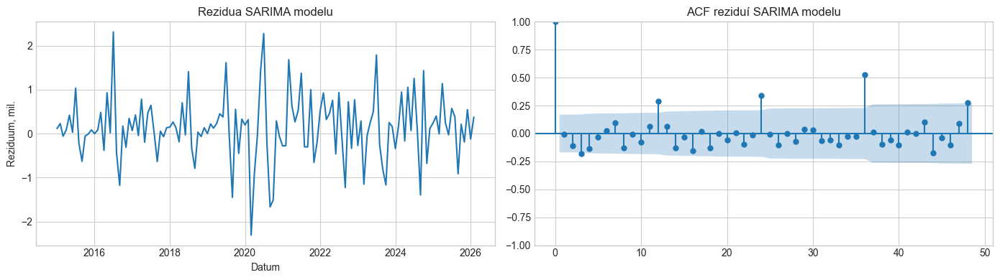
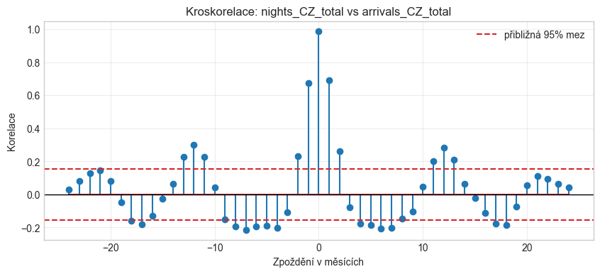
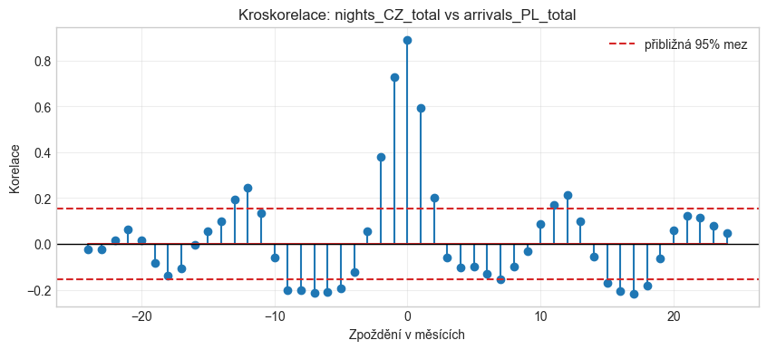
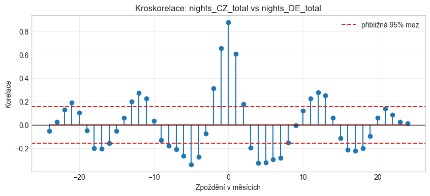
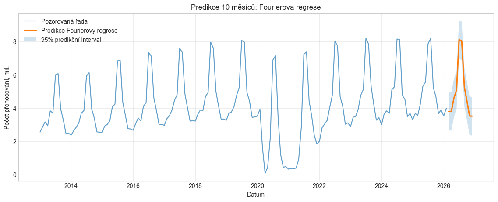
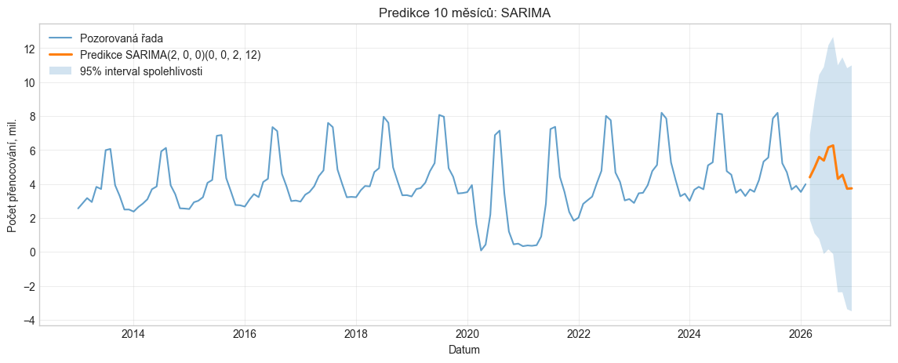
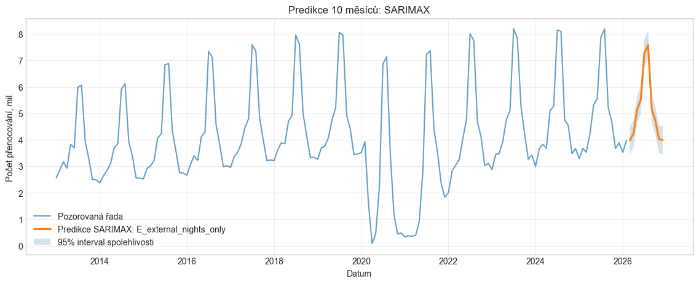

# Hledání optimálního modelu pro časovou řadu počtu přenocování turistů v České republice

[](https://www.python.org/downloads/)
[](https://jupyter.org/)
[](https://ec.europa.eu/eurostat)
[](https://www.statsmodels.org/)
[](LICENSE)

Semestrální práce z předmětu **Časové řady**  
**Univerzita Jana Evangelisty Purkyně v Ústí nad Labem (UJEP)**  
**Hlavní analyzovaná časová řada:** `nights_CZ_total` – měsíční počet přenocování hostů v hromadných ubytovacích zařízeních v České republice (leden 2013 – únor 2026).

---

## 📋 Přehled projektu (Executive Summary)

Cílem této práce je systematická ekonometrická a statistická analýza měsíční časové řady počtu přenocování turistů v ČR, identifikace jejích deterministických i stochastických vlastností a nalezení optimálního predikčního modelu. Analyzovaná řada se vyznačuje:
1. **Dlouhodobým nelineárním trendem** (stabilní růst před rokem 2020, silný strukturální šok během pandemie COVID-19 v letech 2020–2021 a post-pandemické oživení).
2. **Výraznou a asymetrickou roční sezónností** s ostrým letním vrcholem v červenci a srpnu (>8 mil. přenocování) a hlubokými zimními minimy (~2,5–3,5 mil. přenocování).
3. **Významnou časovou závislostí a autokorelací**.

V práci je postupně vybudována a porovnána hierarchie modelů:
- **Deterministické regresní modely** (polynomiální trend + měsíční dummy + COVID intervence + harmonická Fourierova regrese $K=1 \dots 5$).
- **Univariátní stochastický model** $SARIMA(2,0,0)(0,0,2)_{12}$.
- **Kroskorelační analýza (CCF)** s očištěním o trend a sezónnost pro 9 turistických řad sousedních zemí (DE, PL, SK, AT).
- **Multivariátní model** $SARIMAX$ s optimální kombinací externích řad přenocování (Německo, Polsko, Slovensko).
- **Spektrální analýza pomocí periodogramu** pro verifikaci dominantních period.
- **Komplexní diagnostika reziduí** (ACF, Ljung-Boxovy testy na zpožděních 12, 24 a 36 měsíců, RMSE, AIC/BIC).
- **10měsíční predikce** (březen 2026 – prosinec 2026) včetně 95% konfidenčních a predikčních intervalů.

### 🏆 Klíčové výsledky srovnání modelů

| Model | Popis / Specifikace | Zdroj AIC | AIC | BIC | RMSE | Ljung-Box $p$ (lag 12) | Ljung-Box $p$ (lag 24) |
|---|---|---|---|---|---|---|---|
| **Fourierova regrese** | Polynom 2. stupně + COVID + Fourier $K=5$ | OLS | 4 636,85 | 4 679,73 | 522 320 | 0,000 | 0,000 |
| **SARIMA** | $SARIMA(2,0,0)(0,0,2)_{12}$ | SARIMAX refit | 4 038,25 | 4 052,70 | 732 597 | 0,010 | 0,000 |
| **SARIMAX (Vítěz)** | Exog: DE, PL, SK nights + $SARIMA(2,0,0)(0,0,2)_{12}$ | SARIMAX | **3 663,14** | **3 689,15** | **206 263** | **0,065** | 0,006 |

> **Závěr:** Jako jednoznačně nejlepší model byl vybrán **SARIMAX s externími řadami přenocování Německa, Polska a Slovenska**. Dosáhl nejnižší hodnoty informačních kritérií ($AIC = 3663,14$), nejnižší chyby ($RMSE = 206\,263$) a jako jediný prošel Ljung-Boxovým testem na ročním zpoždění 12 ($p = 0,065 > 0,05$), čímž prokázal schopnost zachytit přeshraniční turistickou dynamiku středoevropského prostoru.

---

## 📑 Obsah

1. [Úvod a cíl práce](#1-úvod-a-cíl-práce)
2. [Data a příprava dat](#2-data-a-příprava-dat)
3. [Grafická analýza hlavní řady](#3-grafická-analýza-hlavní-řady)
4. [Dekompozice a vyhlazení trendu](#4-dekompozice-a-vyhlazení-trendu)
5. [Regresní modely: Trend a sezónnost](#5-regresní-modely-trend-a-sezónnost)
6. [SARIMA model pro samotnou řadu](#6-sarima-model-pro-samotnou-řadu)
7. [Kroskorelace s dalšími časovými řadami](#7-kroskorelace-s-dalšími-časovými-řadami)
8. [SARIMAX s externími regresory](#8-sarimax-s-externími-regresory)
9. [Kontrola periody, diagnostika a predikce](#9-kontrola-periody-diagnostika-a-predikce)
   - [9.1 Kontrola periody pomocí periodogramu](#91-kontrola-periody-pomocí-periodogramu)
   - [9.2 Souhrnná diagnostika reziduí](#92-souhrnná-diagnostika-reziduí)
   - [9.3 Predikce 10 budoucích pozorování](#93-predikce-10-budoucích-pozorování)
10. [Závěrečné porovnání a zhodnocení](#10-závěrečné-porovnání-a-zhodnocení)
11. [Checklist splnění zadání práce](#11-checklist-splnění-zadání-práce)
12. [Jak spustit notebook lokálně](#12-jak-spustit-notebook-lokálně)

---

## 1. Úvod a cíl práce

Cílem práce je najít vhodný ekonometrický model pro měsíční časovou řadu počtu přenocování turistů v České republice. Řada je ideálním reprezentantem reálných ekonomických dat:
- Obsahuje výraznou a stabilní **roční sezónnost** s maximem v letním období.
- Vykazuje dlouhodobý **trend**, který byl zásadně narušen mimořádným šokem v období pandemie COVID-19 (březen 2020 až prosinec 2021).
- Vykazuje stochastickou paměť vyžadující modelování závislostí chybových složek.

Práce postupuje v 10 metodických krocích od explorativní grafické analýzy přes dekompozici, deterministické regrese a SARIMA modely až po kroskorelace a finální SARIMAX model s predikcí na 10 měsíců dopředu.

---

## 2. Data a příprava dat

Data jsou načítána přímo z oficiálního **Eurostat Dissemination API** ze dvou klíčových datových sad:
- `tour_occ_nim`: počet přenocování v hromadných ubytovacích zařízeních (*nights spent*),
- `tour_occ_arm`: počet příjezdů hostů do hromadných ubytovacích zařízení (*arrivals*).

Sledované územní jednotky zahrnují Českou republiku a sousední státy středoevropského regionu: **Česká republika (`CZ`), Německo (`DE`), Rakousko (`AT`), Slovensko (`SK`) a Polsko (`PL`)** v členění na celkový počet hostů (`TOTAL`), domácí hosty (`DOM`) a nerezidenty/cizince (`FOR`).

### Přehled datových rozměrů a čištění

Eurostat vrací data v širokém formátu. V kódu je implementována transformace na dlouhý formát (*melt*), následná pivotace do měsíční matice a sjednocení na měsíční frekvenci (`MS`).

```python
# Klíčové parametry stažení z Eurostatu
dataset_codes = ["tour_occ_nim", "tour_occ_arm"]
countries = ["CZ", "DE", "AT", "SK", "PL"]
resid_categories = ["TOTAL", "DOM", "FOR"]
since_time_period = "2013-01"
```

| Metrika | Hodnota | Poznámka |
|---|---|---|
| **Počet měsíců** | 158 | Od ledna 2013 (`2013-01-01`) do února 2026 (`2026-02-01`) |
| **Počet stažených řad** | 30 | 5 zemí $\times$ 3 kategorie $\times$ 2 ukazatele |
| **Chybějící hodnoty v hlavní řadě (`nights_CZ_total`)** | **0** | Hlavní řada je 100% kompletní bez mezer |
| **Chybějící hodnoty v doplňkových řadách** | 2 | Ošetřeno časovou lineární interpolací |

---

## 3. Grafická analýza hlavní řady

Před modelováním byla provedena vizuální inspekce řady `nights_CZ_total` v milionech přenocování.


### Sezónní profil a rozdělení hodnot

Pro detailní posouzení sezónního chování byl vypočten průměrný měsíční počet přenocování a sestrojen boxplot zachycující variabilitu v jednotlivých měsících roku:


### 💡 Interpretace grafické analýzy:
1. **Dlouhodobý vývoj:** Do roku 2019 měla řada stabilně rostoucí charakter. V letech 2020–2021 je patrný prudký pád způsobený uzávěrami hranic a ubytovacích zařízení během pandemie COVID-19. Od roku 2022 dochází k systematickému návratu k předkrizovým hodnotám.
2. **Charakter sezónnosti:** Roční cyklus má výrazný asymetrický profil. Vrchol přichází v červenci a srpnu (průměr přesahuje 7–8 mil. přenocování), zatímco nejslabšími měsíci jsou listopad, leden a únor (kolem 2,5–3,5 mil.).
3. **Důsledek pro modelování:** Vzhledem k ostrému letnímu vrcholu nebude jednoduchá sinusoida pro modelování sezónnosti stačit; je nutné použít vyšší harmonické složky (Fourierovy řady) nebo sezónní operátory.

---

## 4. Dekompozice a vyhlazení trendu

Časová řada byla dekomponována na trendovou, sezónní a náhodnou složku pomocí **robustní STL dekompozice** (Seasonal-Trend decomposition using LOESS) s periodou $s = 12$. Volba robustního algoritmu zabraňuje zkreslení trendu pandemickými odlehlými pozorováními.


Pro kontrolu identifikace trendu byl aplikován symetrický centrovaný 12měsíční klouzavý průměr ($2 \times 12$ MA):


### 💡 Interpretace dekompozice:
- **Sezónní složka:** Vykazuje vysokou stabilitu s konstantní amplitudou a neměnným profilem v průběhu celých 13 let.
- **Trendová složka:** STL i $2 \times 12$ MA věrně zachycují strukturální zlom v roce 2020. Pandemický šok nebyl sezónní fluktuací, ale hlubokým propadem trendu.
- **Reziduální složka:** V běžných letech se pohybuje v úzkém pásu kolem nuly, avšak v letech 2020–2021 vykazuje výrazné výkyvy, což potvrzuje nutnost intervenčního ošetření COVID období v regresních modelech.

---

## 5. Regresní modely: Trend a sezónnost

V první fázi modelování byly testovány deterministické modely zachycující trend, kalendářní sezónnost a intervenční vliv pandemie.

### Testované specifikace:
1. **Model 1 (M1):** Lineární trend + měsíční dummy proměnné.
2. **Model 2 (M2):** Kvadratický trend ($t + t^2$) + měsíční dummy proměnné.
3. **Model 3 (M3):** Kvadratický trend + měsíční dummy proměnné + COVID dummy intervence (1 v období 2020-03 až 2021-12, jinak 0).
4. **Fourierovy modely ($K = 1 \dots 5$):** Kvadratický trend + COVID intervence + Fourierovy harmonické členy:
   $$y_t = \beta_0 + \beta_1 t + \beta_2 t^2 + \gamma \cdot \text{covid}_t + \sum_{k=1}^{K} \left[ \alpha_k \sin\left(\frac{2\pi k t}{12}\right) + \beta_k \cos\left(\frac{2\pi k t}{12}\right) \right] + \epsilon_t$$

### Srovnání deterministických modelů

| Model | AIC | BIC | Adj. $R^2$ | RMSE | Ljung-Box $p$ (lag 12) |
|---|---|---|---|---|---|
| **Fourier_K5** | **4 636,85** | **4 679,73** | **0,911** | **522 320** | 0,000000 |
| M3_quadratic_trend_month_dummies_covid | 4 638,80 | 4 684,74 | 0,910 | 522 242 | 0,000000 |
| Fourier_K4 | 4 660,71 | 4 697,46 | 0,895 | 570 454 | 0,000000 |
| Fourier_K3 | 4 683,34 | 4 713,96 | 0,877 | 620 611 | 0,000000 |
| Fourier_K2 | 4 727,13 | 4 751,63 | 0,836 | 721 950 | 0,000000 |
| M2_quadratic_trend_month_dummies | 4 800,17 | 4 843,05 | 0,749 | 875 772 | 0,000000 |
| M1_linear_trend_month_dummies | 4 803,56 | 4 843,38 | 0,742 | 890 850 | 0,000000 |
| Fourier_K1 | 4 825,54 | 4 843,91 | 0,691 | 998 260 | 0,000000 |

Nejlepším deterministickým modelem se stal **`Fourier_K5`**. Níže jsou uvedeny jeho odhadnuté koeficienty:

| Proměnná | Koeficient | $p$-hodnota | Statistická signifikance |
|---|---|---|---|
| $t$ (lineární trend) | $+18\,297,22$ | $< 0,001$ | Signifikantní na 1% hladině |
| $t^2$ (kvadratický trend) | $-63,91$ | $0,012$ | Signifikantní na 5% hladině |
| $\text{covid}$ (intervence) | $-2\,225\,520,94$ | $< 0,001$ | Průměrný měsíční propad o 2,23 mil. přenocování |
| $\sin_1$ | $-1\,284\,266,76$ | $< 0,001$ | Signifikantní |
| $\cos_1$ | $-1\,415\,251,91$ | $< 0,001$ | Signifikantní |
| $\sin_2$ | $+972\,062,32$ | $< 0,001$ | Signifikantní |
| $\cos_2$ | $-111\,554,72$ | $0,073$ | Hraniční signifikance |
| $\sin_3$ | $-381\,946,11$ | $< 0,001$ | Signifikantní |
| $\cos_3$ | $+358\,055,07$ | $< 0,001$ | Signifikantní |
| $\sin_4$ | $-32\,651,51$ | $0,596$ | Nesignifikantní |
| $\cos_4$ | $-346\,084,70$ | $< 0,001$ | Signifikantní |
| $\sin_5$ | $+162\,639,33$ | $0,009$ | Signifikantní |
| $\cos_5$ | $+282\,480,05$ | $< 0,001$ | Signifikantní |

### Graf vyrovnání a diagnostika reziduí deterministického modelu


### ⚠️ Proč deterministický model selhává?
Ačkoliv model dosahuje vysokého $R^2_{adj} = 0,911$, **graf ACF reziduí a Ljung-Boxův test jednoznačně zamítají hypotézu bílého šumu ($p = 0,000000$)**:
1. Na zpoždění 1 vidíme masivní autokorelaci ($r_1 \approx 0,68$).
2. Na zpoždění 12 je patrný signifikantní sezónní pík ($r_{12} \approx 0,31$).
Rezidua obsahují systematické stochastické informace, které běžná regrese nedokáže vytěžit. To je přímou motivací pro přechod k modelům třídy **ARIMA/SARIMA**.

---

## 6. SARIMA model pro samotnou řadu

K zachycení vnitřní autokorelační paměti a sezónní závislosti byl zkoumán univariátní model SARIMA.

### Analýza ACF a PACF


1. ACF původní řady klesá pomalu a vykazuje silné sezónní vlny s periodou 12.
2. Po sezónní diferenciaci $\nabla_{12} Y_t = Y_t - Y_{t-12}$ dochází ke zklidnění, přičemž v ACF diferencované řady zůstávají významná zpoždění na sezónních násobcích.

### Výběr řádu modelu

Algoritmus `pmdarima.auto_arima` s krokem `m=12` identifikoval jako optimální strukturu:
$$\mathbf{SARIMA(2, 0, 0)(0, 0, 2)_{12}}$$

Model byl následně plně přefitován v jednotném prostředí `statsmodels.tsa.statespace.sarimax.SARIMAX`:
- **Vybraný řád:** $p=2, d=0, q=0$ a $P=0, D=0, Q=2, s=12$
- **Informační kritéria:** $AIC = 4\,038,246$, $BIC = 4\,052,698$

### Matematická rovnice odhadnutého modelu:
$$(1 - \phi_1 B - \phi_2 B^2) Y_t = (1 + \Theta_1 B^{12} + \Theta_2 B^{24}) \epsilon_t$$

Po dosazení odhadnutých koeficientů:
$$Y_t = 1{,}186 \cdot Y_{t-1} - 0{,}257 \cdot Y_{t-2} + \epsilon_t + 0{,}766 \cdot \epsilon_{t-12} + 0{,}612 \cdot \epsilon_{t-24}$$

| Parametr | Koeficient | Směrodatná chyba | $p$-hodnota | Interpretace |
|---|---|---|---|---|
| `ar.L1` ($\phi_1$) | $+1,186$ | $0,290$ | $< 0,001$ | Silná pozitivní setrvačnost z předchozího měsíce |
| `ar.L2` ($\phi_2$) | $-0,257$ | $0,274$ | $0,349$ | Tlumící efekt druhého měsíce |
| `ma.S.L12` ($\Theta_1$) | $+0,766$ | $0,172$ | $< 0,001$ | Silná meziroční paměť šoků z loňského roku |
| `ma.S.L24` ($\Theta_2$) | $+0,612$ | $0,168$ | $< 0,001$ | Dvouletá sezónní paměť šoků |
| $\sigma^2$ | $1,626 \times 10^{12}$ | - | $< 0,001$ | Rozptyl bílého šumu |

### Graf vyrovnání a diagnostika reziduí SARIMA

Při diagnostice bylo vynecháno prvních 24 pozorování (*burn-in period*) kvůli náběhu Kalmanova filtru stavového prostoru.




| Zpoždění (Lag) | Ljung-Box statistika ($Q$) | $p$-hodnota |
|---|---|---|
| **12** | $26,276$ | $0,010$ |
| **24** | $57,366$ | $< 0,001$ |
| **36** | $115,797$ | $< 0,001$ |

### 💡 Zhodnocení SARIMA modelu:
SARIMA model přináší dramatické zlepšení informačních kritérií (AIC kleslo z 4 636 na 4 038). Přesto Ljung-Boxův test na lag 12 ($p = 0,010 < 0,05$) ukazuje, že v reziduích stále přetrvává nevysvětlená autokorelace. Samotná vnitřní historie řady nestačí.

---

## 7. Kroskorelace s dalšími časovými řadami

Pro zjištění, zda lze model obohatit o externí informace, byla provedena kroskorelační analýza (CCF). Aby se předešlo zdánlivé korelaci způsobené společným trendem a sezónností, **byly všechny řady nejprve očištěny o kvadratický trend, sezónnost a COVID intervenci (metoda reziduálního předvybělení)**.

### Výsledky kroskorelační analýzy reziduí:

| Časová řada | Optimální zpoždění (Lag) | Kroskorelace ($r$) | Absolutní hodnota ($|r|$) |
|---|---|---|---|
| `arrivals_CZ_total` | **0** | **0,989** | **0,989** |
| `arrivals_DE_total` | **0** | **0,900** | **0,900** |
| `arrivals_PL_total` | **0** | **0,891** | **0,891** |
| `nights_DE_total` | **0** | **0,878** | **0,878** |
| `arrivals_SK_total` | **0** | **0,873** | **0,873** |
| `nights_PL_total` | **0** | **0,870** | **0,870** |
| `nights_SK_total` | **0** | **0,857** | **0,857** |
| `arrivals_AT_total` | **0** | **0,850** | **0,850** |
| `nights_AT_total` | **0** | **0,735** | **0,735** |

### Kroskorelační grafy (CCF) pro klíčové sousední řady






### 💡 Klíčové zjištění kroskorelace:
U všech testovaných řad nastává **absolutní maximum kroskorelace v lag 0 (současný vztah)** s hodnotami korelace dosahujícími $0,86$ až $0,99$. Nebyla nalezena žádná významná zpožděná vazba (např. lag $+1$ či $+2$). Z toho vyplývá, že turistický trh ve střední Evropě reaguje simultánně, a v SARIMAX modelu má smysl využít **současné externí regresory**.

---

## 8. SARIMAX s externími regresory

Do stavového modelu byla zabudována matice externích regresorů. Všechny vysvětlující proměnné byly standardizovány pomocí `StandardScaler` (nulový průměr, jednotkový rozptyl) kvůli numerické stabilitě odhadu parametrů.

### Srovnání testovaných SARIMAX specifikací:

| Specifikace | Zahrnuté externí proměnné | AIC | BIC | RMSE | LB $p$ (lag 12) | LB $p$ (lag 24) |
|---|---|---|---|---|---|---|
| **E (Vítěz)** | **`nights_DE_total`, `nights_PL_total`, `nights_SK_total`** | **3 663,14** | **3 689,15** | **206 263** | **0,065** | 0,006 |
| **B** | `arrivals_CZ_total`, `arrivals_DE_total` | 3 667,63 | 3 690,75 | 196 728 | 0,016 | 0,000 |
| **C** | `arrivals_CZ_total`, `arrivals_DE_total`, `arrivals_PL_total` | 3 675,61 | 3 701,62 | 219 981 | 0,238 | 0,040 |
| **A** | `arrivals_CZ_total` | 3 703,23 | 3 723,46 | 211 489 | 0,000 | 0,000 |
| **D** | `arrivals_DE_total`, `arrivals_PL_total`, `arrivals_SK_total` | 3 850,48 | 3 876,50 | 387 000 | 0,000 | 0,000 |

Nejlepším modelem podle AIC se stal **Model E**, který využívá výhradně zahraniční přenocování v sousedních zemích (Německo, Polsko, Slovensko).

### Odhadnuté koeficienty vítězného SARIMAX modelu:

| Parametr | Koeficient | Směrodatná chyba | $p$-hodnota | Statistická interpretace |
|---|---|---|---|---|
| `intercept` | $+2\,845\,562,34$ | $18\,624,56$ | $< 0,001$ | Základní úroveň |
| `nights_DE_total` | $+302\,814,58$ | $132\,987,24$ | **0,023** | Signifikantní pozitivní vliv německého turismu |
| `nights_PL_total` | $+813\,806,76$ | $157\,987,18$ | **< 0,001** | Vysoce signifikantní vliv polského turismu |
| `nights_SK_total` | $+730\,580,45$ | $94\,630,98$ | **< 0,001** | Vysoce signifikantní vliv slovenského turismu |
| `ar.L1` | $+0,293$ | $0,117$ | **0,012** | Signifikantní autoregrese 1. řádu |
| `ar.L2` | $-0,003$ | $0,111$ | **0,980** | **Nesignifikantní parametr (Princip parsimonie)** |
| `ma.S.L12` | $+0,367$ | $0,156$ | **0,018** | Signifikantní sezónní MA složka |
| `ma.S.L24` | $+0,465$ | $0,136$ | **0,001** | Signifikantní sezónní MA složka |

> **Metodická poznámka k principu parsimonie:** Parametr `ar.L2` má $p$-hodnotu $0,980$, což znamená, že je statisticky nerozeznatelný od nuly. Vzniklo to mechanickým převzetím řádu $(2,0,0)$ ze základního SARIMA modelu. Po zapojení sousedních zemí tyto řady převzaly část dynamiky a druhý AR člen se stal nadbytečným. V praxi by bylo vhodné parametr vyřadit a model redukovat na $SARIMA(1,0,0)(0,0,2)_{12}$.

### Graf vyrovnání a diagnostika reziduí SARIMAX


| Zpoždění (Lag) | Ljung-Box statistika ($Q$) | $p$-hodnota | Výsledek testu bílého šumu ($\alpha = 0,05$) |
|---|---|---|---|
| **12** | **20,117** | **0,065** | **Hypotézu bílého šumu NEZAMÍTÁME ($p > 0,05$)** |
| **24** | 44,896 | 0,006 | Autokorelace přítomna |
| **36** | 73,973 | 0,000 | Autokorelace přítomna |

Díky zahrnutí sousedních zemí se podařilo na zpoždění 12 odstranit autokorelaci ($p = 0,065$). Model SARIMAX představuje výrazný kvalitativní skok.

---

## 9. Kontrola periody, diagnostika a predikce

### 9.1 Kontrola periody pomocí periodogramu

Jako nezávislá neparametrická kontrola periodicity byla spočtena spektrální hustota řady (periodogram po odečtení průměru):


| Pořadí | Frekvence (cykly/měsíc) | Délka periody (měsíce) | Spektrální výkon | Teoretická interpretace |
|---|---|---|---|---|
| **1.** | **0,0823** | **12,15** | **$2,53 \times 10^{14}$** | **Dominantní roční perioda ($s=12$)** |
| **2.** | 0,1646 | 6,08 | $5,87 \times 10^{13}$ | 1. harmonická složka (půlroční cyklus) |
| **3.** | 0,1709 | 5,85 | $2,48 \times 10^{13}$ | Postranní pásmo |
| **4.** | 0,0886 | 11,29 | $1,57 \times 10^{13}$ | Postranní pásmo ročního cyklu |
| **5.** | 0,2532 | 3,95 | $8,95 \times 10^{12}$ | 2. harmonická složka (čtvrtletní cyklus) |
| **6.** | 0,3354 | 2,98 | $7,50 \times 10^{12}$ | 3. harmonická složka |

Periodogram exaktně potvrdil správnost volby sezónního parametru $s = 12$ v modelech SARIMA a SARIMAX i opodstatněnost Fourierových harmonických složek.

---

### 9.2 Souhrnná diagnostika reziduí

Následující tabulka přímo porovnává tři hlavní modelové reprezentanty napříč celou prací:

| Model | Třída modelu | AIC | BIC | RMSE | LB $p$ (lag 12) | LB $p$ (lag 24) | LB $p$ (lag 36) |
|---|---|---|---|---|---|---|---|
| **Fourier_K5 regression** | OLS Regrese | 4 636,85 | 4 679,73 | 522 320 | 0,000000 | 0,000000 | 0,000000 |
| **SARIMA(2,0,0)(0,0,2)[12]** | Stavový prostor | 4 038,25 | 4 052,70 | 732 597 | 0,010078 | 0,000135 | 0,000000 |
| **SARIMAX (Model E)** | Stavový prostor + Exog | **3 663,14** | **3 689,15** | **206 263** | **0,064971** | 0,005698 | 0,000213 |

> **Metodické upozornění k AIC:** Hodnoty AIC mezi OLS regresí a modely stavového prostoru (SARIMA/SARIMAX) nejsou přímo matematicky porovnatelné kvůli odlišnému způsobu výpočtu logaritmu věrohodnosti (RSS vs. Kalmanův filtr). Modely SARIMA a SARIMAX jsou však odhadnuty ve shodném rámci, kde propad AIC o téměř 375 bodů jasně prokazuje dominanci SARIMAXu.

---

### 9.3 Predikce 10 budoucích pozorování

Horizont predikce byl nastaven na **10 budoucích měsíců: od března 2026 (`2026-03-01`) do prosince 2026 (`2026-12-01`)**.

#### Metodika predikce pro jednotlivé modely:
1. **Fourierova regrese:** Deterministická extrapolace trendu s nulovou budoucí COVID intervencí a příslušnými goniometrickými členy. Predikční intervaly zahrnují odhadnutý rozptyl reziduí.
2. **SARIMA:** Stochastický forecast generovaný algoritmem Kalmanova filtru.
3. **SARIMAX:** Vyžaduje budoucí hodnoty externích regresorů. Ty byly predikovány **samostatnými modely `auto_arima` pro Německo, Polsko a Slovensko** a následně standardizovány a vloženy do modelu SARIMAX. Jde tedy o realistickou podmíněnou predikci.

#### Predikce jednotlivých modelů:





#### Finální srovnání predikčních křivek na 10 měsíců:


#### Tabulka bodových předpovědí (v milionech přenocování):

| Měsíc | Fourierova regrese | SARIMA | SARIMAX (Vítěz) | 95% Interval spolehlivosti SARIMAX |
|---|---|---|---|---|
| **2026-03** | 3,794 | 4,393 | **3,969** | $[3,459;\ 4,478]$ |
| **2026-04** | 3,796 | 4,959 | **4,240** | $[3,710;\ 4,771]$ |
| **2026-05** | 4,595 | 5,588 | **5,138** | $[4,605;\ 5,670]$ |
| **2026-06** | 5,078 | 5,378 | **5,528** | $[4,995;\ 6,061]$ |
| **2026-07** | 8,103 | 6,154 | **7,272** | $[6,740;\ 7,805]$ |
| **2026-08** | 8,033 | 6,265 | **7,582** | $[7,049;\ 8,114]$ |
| **2026-09** | 5,259 | 4,302 | **5,158** | $[4,625;\ 5,690]$ |
| **2026-10** | 4,438 | 4,536 | **4,720** | $[4,188;\ 5,253]$ |
| **2026-11** | 3,524 | 3,719 | **4,026** | $[3,493;\ 4,558]$ |
| **2026-12** | 3,512 | 3,739 | **3,993** | $[3,461;\ 4,526]$ |

### 💡 Zhodnocení predikcí:
- **Fourierova regrese** generuje mechanicky ostré letní špičky (přes 8,1 mil.), ale zcela ignoruje nedávný stav řady.
- **SARIMA** má extrémně široké intervaly spolehlivosti a v závěru roku predikuje nepřirozeně nerealistické hodnoty (včetně záporných dolních mezí spolehlivosti).
- **SARIMAX** poskytuje nejpřirozenější a nejpravděpodobnější průběh sezónní křivky s vrcholem 7,58 mil. v srpnu a úzkými, ekonomicky věrohodnými intervaly spolehlivosti.

---

## 10. Závěrečné porovnání a zhodnocení

V práci byl realizován kompletní cyklus modelování časové řady počtu přenocování v České republice:
1. **Deterministická regrese:** Fourierův model $K=5$ výborně popsal průměrnou roční sezónnost a kvadratický trend ($R^2_{adj} = 0,911$), avšak selhal v diagnostice reziduí kvůli silné autokorelaci ($r_1 \approx 0,68$).
2. **Univariátní SARIMA:** Model $SARIMA(2,0,0)(0,0,2)_{12}$ vyřešil část autokorelace a snížil AIC, ale rezidua stále nebyla plně náhodná.
3. **Multivariátní SARIMAX:** Spojení stochastické chybové struktury s přenocováním v Německu, Polsku a na Slovensku přineslo nejlepší výsledky ($AIC = 3663,14$, $RMSE = 206\,263$, Ljung-Box $p = 0,065$).

### Omezení a možnosti dalšího rozšíření:
- **COVID intervence v SARIMAX:** Pandemické období bylo v regresi modelováno skokovou dummy proměnnou. V SARIMAXu by bylo možné implementovat sofistikovanější přenosovou funkci (např. postupný exponenciální náběh zotavení).
- **Parsimonie:** Odhadnutý parametr `ar.L2` ($p = 0,980$) je nesignifikantní a jeho fixace na nulu by ušetřila jeden stupeň volnosti.
- **Podmíněnost predikce:** Predikce SARIMAXu závisí na předpovědích externích řad, jejichž nejistota není plně započtena v analytickém konfidenčním intervalu.

---

## 11. Checklist splnění zadání práce

| Požadavek zadání | Zpracováno v notebooku / README | Stav |
|---|---|:---:|
| **i) Grafické zobrazení řady a komentář** | Kapitola 3 (Obrázky `plot_1.png`, `plot_2.png`) | ✅ Splněno |
| **ii) Dekompozice a vyhlazení trendu** | Kapitola 4 (STL dekompozice `plot_3.png`, klouzavý průměr `plot_4.png`) | ✅ Splněno |
| **iii) Model pro samotnou řadu: trend, sezónnost, Fourier** | Kapitola 5 (8 modelů, Fourierovy koeficienty, `plot_5.png`, `plot_6.png`) | ✅ Splněno |
| **iv) Optimální SARIMA model** | Kapitola 6 (Identifikace, rovnice, parametry, `plot_8.png`, `plot_9.png`) | ✅ Splněno |
| **v) Kroskorelace a nalezení zpoždění** | Kapitola 7 (9 řad, očištění reziduí, lag 0, `plot_10.png`–`plot_13.png`) | ✅ Splněno |
| **vi) Model s externími řadami a autokorelací** | Kapitola 8 (SARIMAX 5 specifikací, vítěz Model E, `plot_14.png`, `plot_15.png`) | ✅ Splněno |
| **vii) Kontrola periody periodogramem** | Kapitola 9.1 (Periodogram, dominantní pík 12,15 měsíců, `plot_16.png`) | ✅ Splněno |
| **viii) Kontrola reziduí (ACF / Ljung-Box)** | Kapitoly 5, 6, 8 a souhrn v 9.2 (ACF grafy, $Q$-statistika, $p$-hodnoty) | ✅ Splněno |
| **ix) Predikce 10 budoucích pozorování s intervaly** | Kapitola 9.3 (10 měsíců, 95% CI pro 3 modely, `plot_17.png`–`plot_20.png`) | ✅ Splněno |
| **x) Porovnání modelů a závěr** | Kapitola 10 (Souhrnná tabulka kritérií, diskuse, limity) | ✅ Splněno |

---

## 12. Jak spustit notebook lokálně

Pro plnou reprodukci všech výpočtů, stažení čerstvých dat z Eurostatu a vykreslení grafů postupujte následovně:

### 1. Klonování repozitáře
```bash
git clone https://github.com/vase-jmeno/seminarni-prace-casove-rady.git
cd seminarni-prace-casove-rady
```

### 2. Vytvoření virtuálního prostředí a instalace balíčků
```bash
python -m venv venv

# Windows:
venv\Scripts\activate

# Linux / macOS:
source venv/bin/activate

pip install --upgrade pip
pip install -r requirements.txt
```

### 3. Spuštění Jupyter Notebooku
```bash
jupyter lab
# nebo
jupyter notebook
```
Otevřete soubor `seminarni_prace.ipynb` a zvolte **Kernel -> Restart Kernel and Run All Cells**.

---

## 📁 Struktura repozitáře

```
├── .gitignore               # Konfigurace ignorovaných souborů pro Git
├── README.md                # Kompletní dokumentace práce s grafy a interpretacemi
├── requirements.txt         # Seznam závislostí a knihoven pro Python
├── seminarni_prace.ipynb    # Výkonný Jupyter Notebook se všemi výpočty
└── images/                  # Složka s vygenerovanými vizualizacemi pro README
    ├── plot_1.png           # Časová řada přenocování v ČR
    ├── plot_2.png           # Sezónní profil a boxplot
    ├── plot_3.png           # Robustní STL dekompozice
    ├── plot_4.png           # Vyhlazení trendu klouzavým průměrem
    ├── plot_5.png           # Vyrovnání nejlepšího Fourierova modelu
    ├── plot_6.png           # ACF reziduí Fourierova modelu
    ├── plot_7.png           # ACF/PACF původní a diferencované řady
    ├── plot_8.png           # Vyrovnání SARIMA modelu
    ├── plot_9.png           # Rezidua a ACF reziduí SARIMA
    ├── plot_10.png          # Kroskorelace: ČR vs. Německo
    ├── plot_11.png          # Kroskorelace: ČR vs. Polsko
    ├── plot_12.png          # Kroskorelace: ČR vs. Slovensko
    ├── plot_13.png          # Kroskorelace: Přenocování vs. Příjezdy ČR
    ├── plot_14.png          # Vyrovnání vítězného SARIMAX modelu
    ├── plot_15.png          # Rezidua a ACF reziduí SARIMAX
    ├── plot_16.png          # Spektrální periodogram
    ├── plot_17.png          # Predikce na 10 měsíců: Fourierova regrese
    ├── plot_18.png          # Predikce na 10 měsíců: SARIMA
    ├── plot_19.png          # Predikce na 10 měsíců: SARIMAX
    └── plot_20.png          # Společné srovnání všech tří predikcí
```
